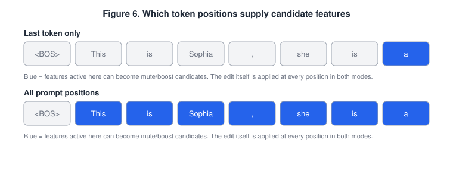
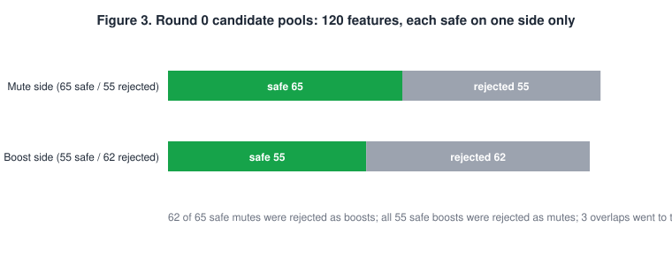
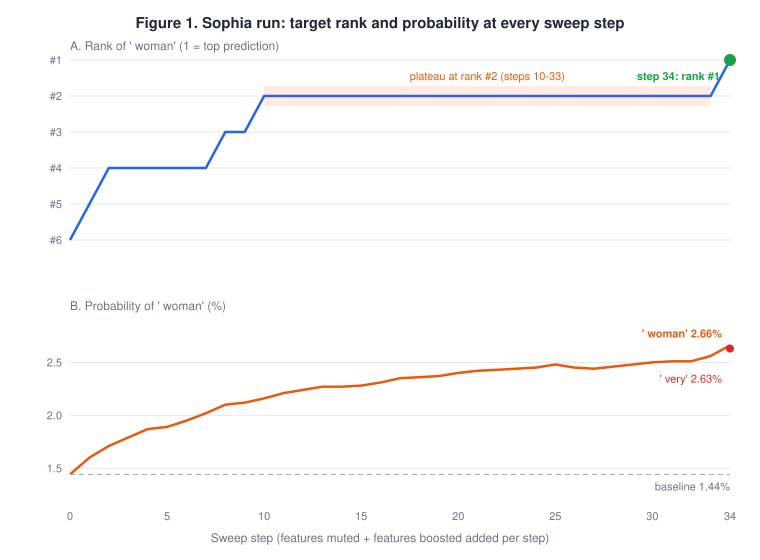
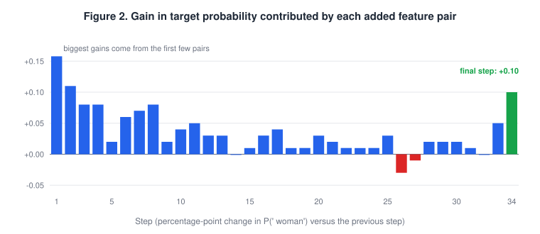
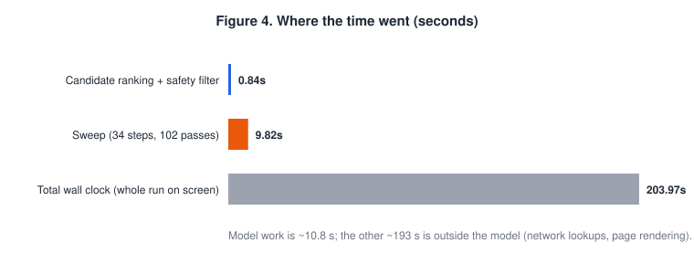
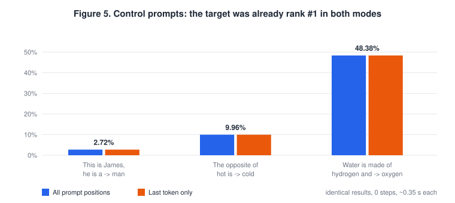
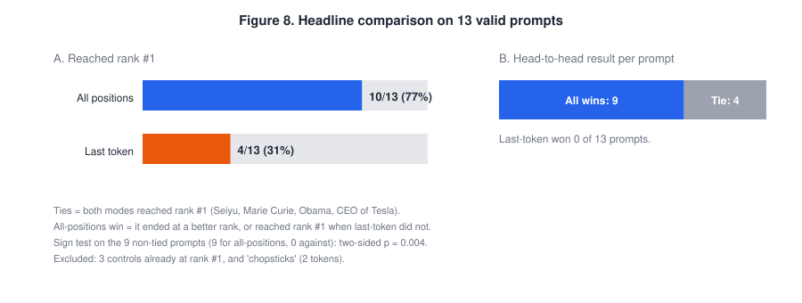
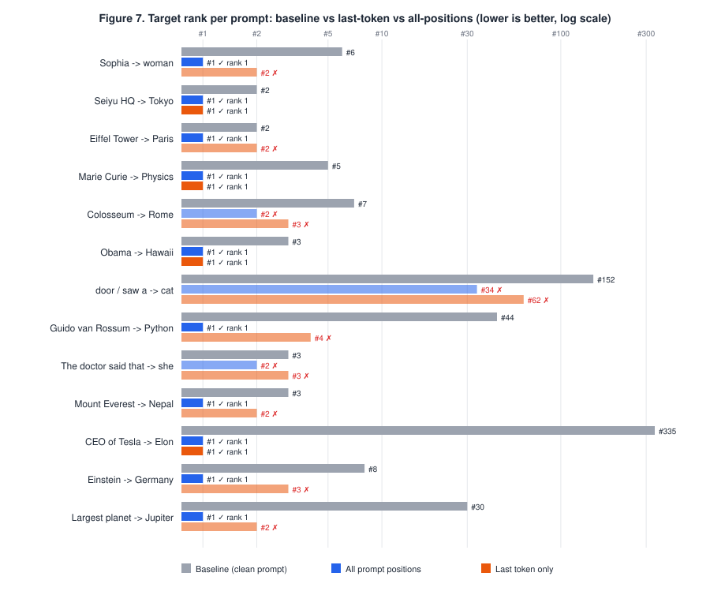
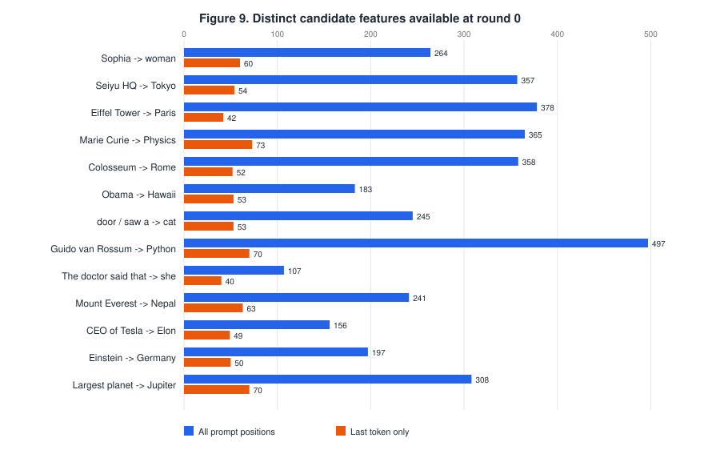
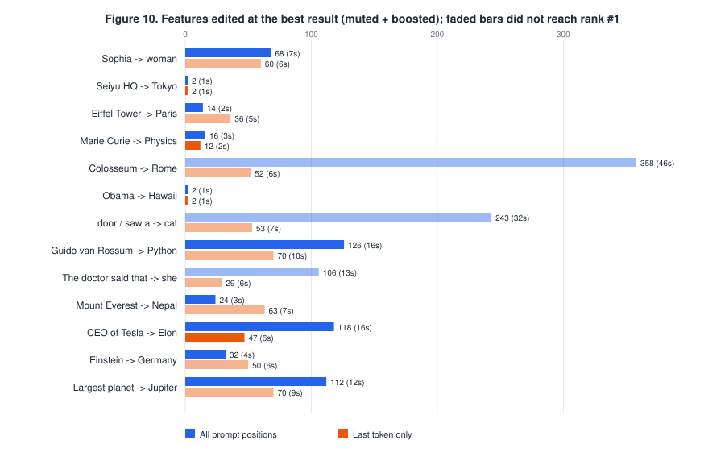

# Research Journal Entry 20: Benchmarking the Hybrid Mute & Boost Pipeline — Last Token vs All Prompt Positions

**Date:** September 25–26, 2026
**Author:** Adi
**Branch:** `pool-refill-implementation`
**Focus:** A structured benchmark of the Hybrid Mute & Boost tab: one worked run, control prompts, and a 17-prompt paired study of the two candidate sources (*All prompt positions* vs *Last token only*) run through a new batch tool.

---

## 1. Summary (read this first)

| Question | Answer |
|---|---|
| Does the pipeline work end to end? | **Yes.** On the Sophia prompt ` woman` went from rank **6 → 1** (1.44% → 2.66%). Across 13 valid test prompts it brought the target to rank #1 on **10 of 13** (baseline ranks 2 to 335). |
| Is it reproducible? | **Yes.** The same 34-run batch was executed twice, once from the Streamlit tab and once from the command line. **Every feature list, step and probability was identical** (0 differences in 34 runs). |
| Is it safe when nothing needs fixing? | **Yes.** On 3 control prompts where the target was already rank #1, no edits were made in either mode (about 0.1 s each). |
| Is *All prompt positions* better than *Last token only*? | **Yes, on this benchmark.** All-positions reached rank #1 on **10/13 (77%)** prompts vs **4/13 (31%)** for last-token. It won 9 prompts, tied 4 and lost **0**. |
| Why? | Last-token draws from a much smaller pool of features (mean **56** vs **281** at round 0). In all 9 prompts where last-token failed, it **ran out of usable features**. |
| What does it cost? | More features edited (mean 94 vs 42 at the best result) and about 2× the run time (12.2 s vs 5.4 s). When both modes succeeded, last-token was as cheap or cheaper. |
| What is *not* shown? | Anything beyond GPT-2 small, layer 8, 13 hand-picked prompts, and "rank #1 on the next token". No side-effect or fluency measurements yet. |

## 2. Background

The Hybrid Mute & Boost tab tries to make a chosen **target token** the model's top prediction by editing sparse-autoencoder (SAE) features in the residual stream:

1. **Find the blocker.** The blocker is the token currently ranked #1 (the thing "in the way"). It is the top-1 token at the start of each round.
2. **Build two candidate lists.**
   - *Mute candidates:* features whose removal lowers the blocker's probability the most.
   - *Boost candidates:* features whose removal lowers the target's probability the most (features that support the target).
3. **Safety-filter both lists.** A mute candidate is dropped if muting it alone hurts the target; a boost candidate is dropped if boosting it alone hurts the target.
4. **Sweep.** Add one mute + one boost per step (`Mute 1 / Boost 1`, then `2 / 2`, …), re-running the model each time, and stop as soon as the target is rank #1. If the safe pools run out first, **pool refill** commits the features, re-ranks against the edited model, and starts a new round.

### 2.1 What "candidate source" means

The edit is applied at **every** token position in both modes. The setting only changes **which features are allowed to be candidates**:

- **Last token only:** features active on the final prompt token.
- **All prompt positions:** features active on *any* prompt token except the start-of-sequence token, scored by their strongest activation.



The motivation: in "This is **Sophia**, she is a", the meaning "female name" is carried by features that fire on the word *Sophia*, not on the final word *a*. A last-token pool may never see them.

## 3. Method

- **Model / SAE:** GPT-2 small, SAE at layer 8 (`blocks.8.hook_resid_pre`), CUDA.
- **Fixed settings for every run:** mute strength 0.6, boost strength 0.5, Top N 120, cumulative sweep on, pool refill on (unlimited rounds), safety filter on, stop-on-rank-1 on, GPU-batched on, AI explanations off.
- **Two experiments:**
  1. *Worked example and manual controls* (Sections 4–5), run by hand in the Hybrid tab.
  2. *Batch study* (Section 6): 17 prompts × 2 modes = **34 runs**, driven by one JSON spec (`data/candidate_source_batch_spec.json`) through the new **Batch: Last vs All Tokens** tab. The tab uses a headless port of the Hybrid tab's logic (`src/hybrid_runner.py`, `src/batch_runner.py`). That port was validated first: on the Sophia prompt it reproduced the manual run exactly in both modes (34 steps, rank 1, 2.66%, identical pools 65/55/55/62 and identical mute IDs for all-positions; 30 steps, 2 rounds, rank 2, 2.48% for last-token).
- **Recorded per run:** baseline and final rank/probability, steps, rounds, features used, pool sizes, per-candidate scores, every sweep step (top-5 table and combination-safety check), rejections, timings, stop reason.
- **Winner rule** (per prompt): reaching rank #1 beats not reaching it; otherwise the better final rank wins; equal outcomes are a tie.
- **Excluded from the comparison:** 3 control prompts already at rank #1 (nothing to steer) and 1 prompt whose target is two tokens (see Section 7).

## 4. Worked example — "This is Sophia, she is a" → ` woman`

### 4.1 Headline numbers (All prompt positions)

| Measure | Value |
|---|---|
| Baseline top-1 | ` beautiful` |
| Baseline rank of target | **#6** (1.44%) |
| Final top-1 | ` woman` (**rank #1**, 2.66%) |
| Runner-up at the end | ` very` at 2.63% (**margin 0.03 points**) |
| Rounds / sweep steps | 1 round / 34 steps (refill not needed) |
| Features changed | 34 muted + 34 boosted = **68** |
| Forward passes | 1 baseline + 16 ranking/safety + 102 sweep = 119 |

### 4.2 Candidate pools (round 0)

120 candidate features were ranked. Each ended up usable on **one side only**:



| Pool | Safe | Rejected |
|---|---|---|
| Mute side | 65 | 55 |
| Boost side | 55 | 62 |

- 62 of the 65 safe mutes were rejected as boosts, and all 55 safe boosts were rejected as mutes: the filter is essentially sorting features by *which direction helps the target*.
- 3 features (23722, 7480, 24468) were safe on both sides; the app kept them on the mute side.
- The effect of any single feature is tiny (the largest rejected feature moved the target by only about −0.0017 percentage points). The gain comes from **stacking many small effects**, not from one decisive feature.

### 4.3 How the target climbed



| Steps | Target rank | Target prob | Note |
|---|---|---|---|
| 0 (baseline) | 6 | 1.44% | |
| 1 | 5 | 1.60% | ` very` becomes top-1 |
| 2–7 | 4 | 1.71–2.02% | |
| 8–9 | 3 | 2.10–2.12% | |
| 10–33 | 2 | 2.16–2.56% | **plateau**: 24 steps for ≈0.4 points |
| 34 | **1** | **2.66%** | wins by 0.03 points |



1. **Diminishing returns.** The first feature pairs gave the biggest gains; from about step 12 each pair added 0.01–0.03 points.
2. **One small regression** at step 25 (2.48% → 2.45%). The sweep keeps the best result so far, so it did not matter.
3. **The last step mattered.** Step 34 added +0.10 points: about half from ` woman` rising (+0.10) and half from ` very` falling (−0.09).

### 4.4 The blocker did not change during the round

The blocker for round 0 was ` beautiful`. After the very first step ` beautiful` was no longer the obstacle — ` very` was — but the **mute list stayed aimed at ` beautiful`** for the rest of the round, because the blocker is only re-selected when a new round starts. This is the most likely reason for the long plateau at rank #2, and a concrete improvement to try (re-select the blocker inside the sweep when the top-1 changes).

### 4.5 Cost



| Stage | Time |
|---|---|
| Candidate ranking + safety filter | 0.84 s |
| Sweep (34 steps) | 9.82 s |
| Model compute total | 10.80 s |
| **Wall clock, whole run on screen** | **204.0 s** |

Almost all the waiting time was outside the model (network lookups for feature descriptions, page rendering).

## 5. Control prompts — nothing to fix

Prompts where the model already predicts the target, run in both modes (part of the batch):

| Prompt | Target | Baseline prob | All positions | Last token | Time s (all / last) |
|---|---|---|---|---|---|
| This is James, he is a | man | 2.72% | no edit | no edit | 0.11 / 0.12 |
| The opposite of hot is | cold | 9.96% | no edit | no edit | 0.14 / 0.13 |
| Water is made of hydrogen and | oxygen | 48.38% | no edit | no edit | 0.11 / 0.14 |



Every run stopped with *"Target is already Rank #1 in the clean baseline — nothing to steer."* The pipeline does not damage a prediction that is already correct, and both modes behave identically in that case.

## 6. Batch study — All prompt positions vs Last token only

**Design:** 14 prompts where the target is *not* already the top prediction, plus the 3 controls, each run in both modes with identical settings (Section 3). 34 runs, 295 seconds total, 0 errors.

### 6.1 Headline result



| Measure (13 valid prompts) | All prompt positions | Last token only |
|---|---|---|
| Reached rank #1 | **10 / 13 (77%)** | 4 / 13 (31%) |
| Head-to-head | **9 wins** | 0 wins (4 ties) |
| Higher final target probability | **12 / 13 prompts** | 0 / 13 (1 identical: Seiyu) |
| Mean final target probability (baseline mean 3.30%) | **9.63%** | 7.50% |
| Round-0 candidate features (mean) | **281** | 56 (5× fewer) |
| Features edited at best result (mean) | 94 | 42 |
| Mean run time | 12.2 s | 5.4 s |

A sign test on the 9 non-tied prompts (9 for all-positions, 0 against) gives a two-sided p ≈ 0.004. Treat that as supportive, not conclusive: the prompts were chosen by us, are not independent draws, and n is small.

### 6.2 Per prompt

| Prompt | Target | Baseline rank | Baseline prob | All: final rank | All: prob | Last: final rank | Last: prob | Winner |
|---|---|---|---|---|---|---|---|---|
| This is Sophia, she is a | woman | #6 | 1.44% | #1 ✅ | 2.66% | #2 ❌ | 2.48% | **all** |
| Seiyu Group's headquarters are in | Tokyo | #2 | 10.00% | #1 ✅ | 14.81% | #1 ✅ | 14.81% | **tie** |
| The Eiffel Tower is in the city of | Paris | #2 | 6.87% | #1 ✅ | 10.79% | #2 ❌ | 10.49% | **all** |
| Marie Curie won the Nobel Prize in | Physics | #5 | 6.34% | #1 ✅ | 11.03% | #1 ✅ | 9.89% | **tie** |
| The Colosseum is located in | Rome | #7 | 0.83% | #2 ❌ | 12.74% | #3 ❌ | 2.40% | **all** |
| Barack Obama was born in | Hawaii | #3 | 5.19% | #1 ✅ | 9.79% | #1 ✅ | 7.16% | **tie** |
| She opened the door and saw a | cat | #152 | 0.07% | #34 ❌ | 0.30% | #62 ❌ | 0.16% | **all** |
| The programming language created by Guido van Rossum is | Python | #44 | 0.30% | #1 ✅ | 6.49% | #4 ❌ | 3.28% | **all** |
| The doctor said that | she | #3 | 4.58% | #2 ❌ | 12.78% | #3 ❌ | 9.15% | **all** |
| Mount Everest is located in | Nepal | #3 | 4.71% | #1 ✅ | 20.05% | #2 ❌ | 19.14% | **all** |
| The CEO of Tesla is | Elon | #335 | 0.04% | #1 ✅ | 6.42% | #1 ✅ | 4.07% | **tie** |
| Albert Einstein was born in | Germany | #8 | 1.97% | #1 ✅ | 7.95% | #3 ❌ | 6.15% | **all** |
| The largest planet in our solar system is | Jupiter | #30 | 0.61% | #1 ✅ | 9.43% | #2 ❌ | 8.30% | **all** |

✅ = target reached rank #1. Ties are prompts where both modes reached rank #1 (Seiyu, Marie Curie, Obama, CEO of Tesla).



Notable cases:

- **Guido van Rossum → Python:** rank 44. All-positions reached #1; last-token stopped at #4.
- **The Eiffel Tower → Paris, Mount Everest → Nepal, Einstein → Germany, Largest planet → Jupiter:** all-positions reached #1; last-token ended at #2, #2, #3 and #2.
- **The CEO of Tesla → Elon:** starting rank 335, both modes reached #1 (all-positions with 118 features, last-token with 47).
- **Colosseum, "…saw a" → cat, "The doctor said that" → she:** neither mode reached #1. All-positions still ended closer in every case (#2 vs #3, #34 vs #62, #2 vs #3).

### 6.3 Why all-positions wins: the pool runs out



- Last-token had only about **40–73 candidate features** per prompt; all-positions had about **110–500**.
- **All 9 of last-token's failures ended with "No unapplied active features remain"**: it used every feature it could see and still was not done. Only 1 of all-positions' 3 failures ended that way; the other two hit a dead end where no candidate passed the safety filter.
- This matches the earlier finding (Entry 19) that steering cannot activate a feature that is off at the tested positions: the more positions you draw candidates from, the more features you have to work with.

### 6.4 The cost side



| Prompt | Candidates (all) | Candidates (last) | Features edited (all) | Features edited (last) | Steps (all) | Steps (last) | Rounds (all) | Rounds (last) | Time s (all) | Time s (last) |
|---|---|---|---|---|---|---|---|---|---|---|
| This is Sophia, she is a | 264 | 60 | 68 | 60 | 34 | 30 | 1 | 2 | 7.4 | 6.0 |
| Seiyu Group's headquarters are in | 357 | 54 | 2 | 2 | 1 | 1 | 1 | 1 | 1.3 | 1.0 |
| The Eiffel Tower is in the city of | 378 | 42 | 14 | 36 | 7 | 23 | 1 | 2 | 2.3 | 4.7 |
| Marie Curie won the Nobel Prize in | 365 | 73 | 16 | 12 | 8 | 6 | 1 | 1 | 2.5 | 1.9 |
| The Colosseum is located in | 358 | 52 | 358 | 52 | 202 | 28 | 5 | 2 | 45.8 | 5.8 |
| Barack Obama was born in | 183 | 53 | 2 | 2 | 1 | 1 | 1 | 1 | 1.4 | 0.8 |
| She opened the door and saw a | 245 | 53 | 243 | 53 | 140 | 31 | 4 | 3 | 32.4 | 6.8 |
| The programming language created by Guido van Rossum is | 497 | 70 | 126 | 70 | 67 | 46 | 2 | 2 | 15.8 | 9.7 |
| The doctor said that | 107 | 40 | 106 | 29 | 59 | 27 | 3 | 2 | 13.2 | 5.8 |
| Mount Everest is located in | 241 | 63 | 24 | 63 | 12 | 33 | 1 | 3 | 3.5 | 7.5 |
| The CEO of Tesla is | 156 | 49 | 118 | 47 | 78 | 29 | 1 | 1 | 16.5 | 6.1 |
| Albert Einstein was born in | 197 | 50 | 32 | 50 | 16 | 26 | 1 | 2 | 4.1 | 5.6 |
| The largest planet in our solar system is | 308 | 70 | 112 | 70 | 57 | 40 | 1 | 3 | 12.3 | 8.9 |

- All-positions is not free: it edits more features and runs longer, especially on hard prompts (the Colosseum run needed 202 steps, 358 features and 46 s and still ended at #2).
- **When both modes succeeded, last-token was never worse:** equal on Seiyu (2 vs 2) and Obama (2 vs 2), cheaper on Marie Curie (12 vs 16) and CEO of Tesla (47 vs 118). All-positions' advantage is *capability* (reaching #1 where last-token cannot), not efficiency.

## 7. Findings and limitations

**Supported by data**

- The full pipeline (pools → safety filter → cumulative sweep → best-result tracking) works and is reproducible bit-for-bit across two independent executions.
- It correctly does nothing when the target is already rank #1.
- **All prompt positions is the better candidate source on this benchmark:** more prompts solved (10 vs 4 of 13), never worse, higher final probability on 12 of 13 (one identical), and the mechanism (much larger candidate pool; last-token exhausts its features) is visible in the data.
- Success can be reached through many small, individually harmless feature edits.

**Not supported yet**

- Any claim beyond GPT-2 small, layer 8, and this set of prompts (13 valid pairs, one run each).
- Robustness: "success" means rank #1 on the very next token only, and several wins were narrow (Sophia: 0.03 points over the runner-up).
- Side effects on unrelated text, and fluency of generated text, were not measured. Editing 100+ features to fix one prediction may well have side effects.
- Whether the gap holds on other models, layers, SAE releases, and on prompts not chosen by us.

**Issues found**

1. **Multi-token targets are silently mis-scored.** `get_target_token_id` keeps only the *last* token of a multi-token word. " chopsticks" is two tokens, so the app scored " sticks" (baseline rank 14,781). This pair is excluded from the comparison. The Batch tab now warns before running, and the Hybrid tab warns too.
2. **Stale blocker within a round** (Section 4.4).
3. **The AI mechanistic explanation is unreliable.** In the Sophia run it referred to names not in the prompt and misdescribed the starting rank: the baseline rank is computed from a variable (`probs`) that is overwritten during the sweep. Do not quote the Groq text as evidence until this is fixed.
4. **On-screen wall-clock time is dominated by non-model work** (network lookups), so it should not be used as a model-speed figure. Batch timings here exclude that and are model time.

## 8. What improved during this work

**In the research**

- The candidate-source hypothesis went from *one suggestive prompt* to a *tested, reproducible result* (10/13 vs 4/13, 9 wins, 0 losses) with a visible mechanism.
- Earlier "run 2" was confirmed to be a last-token run (the headless port reproduces it exactly).
- A silent scoring error (multi-token targets) was found and guarded.
- Two methodological weaknesses are now documented with a proposed fix each (stale blocker; explanation bug).

**In the tooling**

- The app was trimmed from 11 tabs to the 4 that matter (Hybrid Mute & Boost, Monosemanticity Analysis, Session History, Sequential vs Batched Proof) plus the new Batch tab.
- Session History was rewritten: every Hybrid run now saves its settings, pools, every step, rejections, ledger, rank progression, timings and explanations, viewable and downloadable, and auto-saved to disk (`outputs/session_history/`) so a refresh cannot lose data.
- **New Batch tab + CLI (`run_batch.py`):** paste or upload a JSON of prompts, run both modes, get every on-screen item as one JSON plus a paired comparison. The study above (34 runs) took about 5 minutes instead of a night of manual runs.

## 9. Next steps

1. **Fix the stale blocker** (re-select the blocker whenever the top-1 changes) and re-run the batch to see whether the rank-#2 plateaus break.
2. **Measure side effects:** compare next-token distributions and perplexity on unrelated prompts before and after the edit, since the winning runs edit 100+ features.
3. **Widen the benchmark:** 100+ prompts, several layers, ≥ 3 repeats, prompts the team did not pick. Add baselines (activation steering, few-shot prompting).
4. **Fix the explainer bug** (Section 7, issue 3) before using AI explanations in any write-up.
5. **Investigate the three failures** (Colosseum, "…saw a" → cat, "The doctor said that" → she): are they SAE-coverage limits or search limits?

## 10. Files and reproduction

- Figures: `docs/Research_Journal/images/e20_fig1_progress.svg` … `e20_fig10_features_time.svg`
- Data: `benchmark_results/candidate_source_study/`
  - `batch_result_17prompts_layer8.json` — the full 34-run result (every on-screen item per run)
  - `batch_paired_summary.csv` — the per-prompt comparison table
  - `batch_spec_17prompts.json` — the exact input spec
  - `control_runs_*`, `sophia_run_progression.csv` — the earlier manual runs
- Code: `src/hybrid_runner.py`, `src/batch_runner.py`, `run_batch.py`, and the **Batch: Last vs All Tokens** tab in `experiment_app.py`.
- **To reproduce:**

```bash
python run_batch.py data/candidate_source_batch_spec.json outputs/batch_runs/repro.json
```

  Or open the Batch tab, keep the default spec, and click **Run batch**. Expect ~5 minutes on a CUDA GPU and identical numbers.
