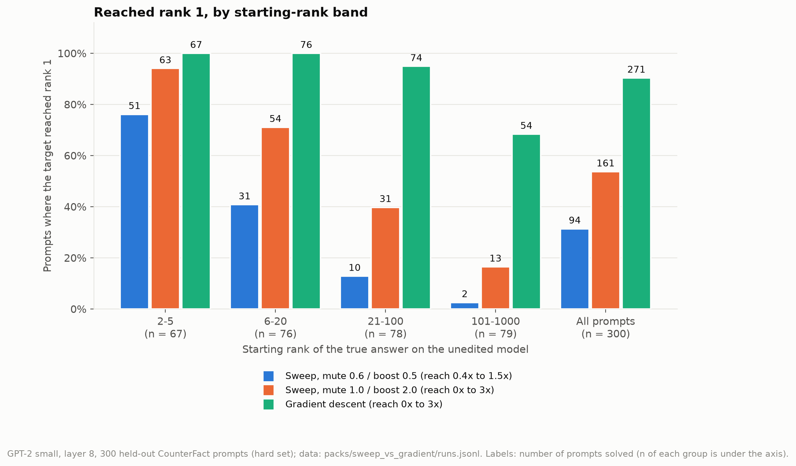
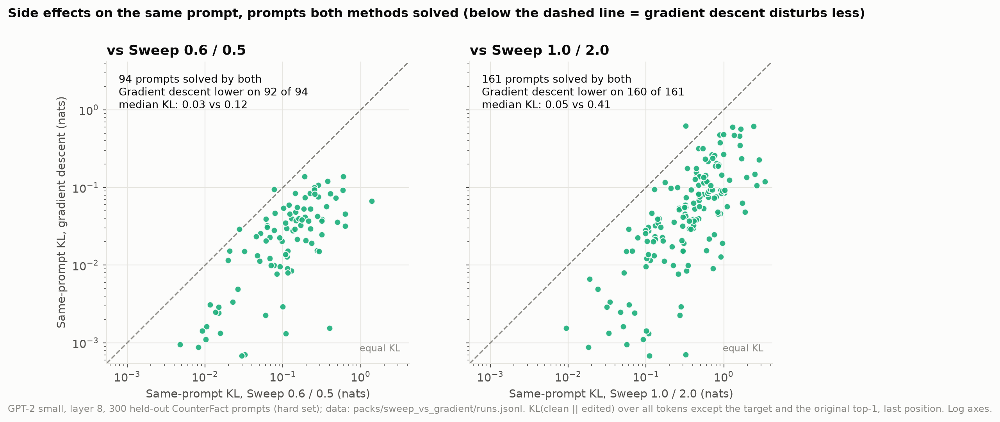
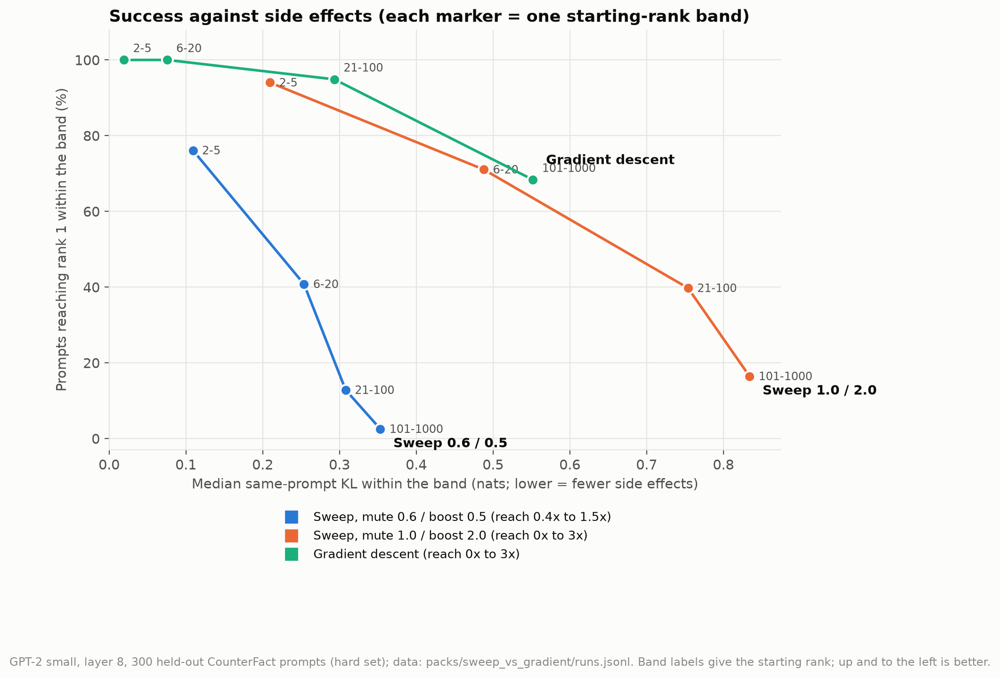
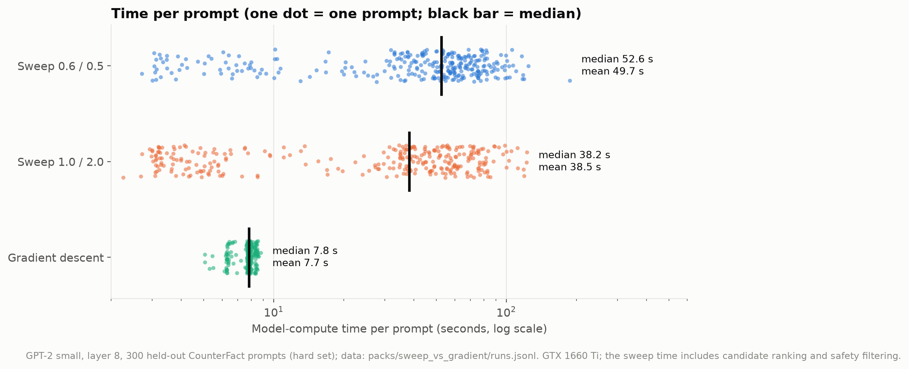

# Research Journal Entry 29: Equal-budget comparison on the 300 held-out prompts: the real sweep (two ranges) vs gradient descent

**Date:** October 3, 2026
**Branch:** `gradient-descent-editing` (tool commit `11eb05e`)
**Status:** COMPLETED on the real model (not the one-shot proxy): 300 of 300 prompts, 0 errors. Resolves two open items of Entry 28 (section 8): the unequal edit budget and the unmeasured side effects of the sweep. Still NOT tested: reworded prompts, nearby facts, generated text, other sweep configurations (see section 6).
**Data:** `docs/Research_Journal/packs/sweep_vs_gradient/` (`runs.jsonl` = one record per prompt with every arm's numbers; `summary.txt`, `summary.json`, `meta.json`). **Tool:** `tools/compare_sweep_vs_gradient.py`.

---

## 1. Question
Entry 28 reported that gradient descent (one multiplier per feature) ended nearer rank 1 than the fixed mute / boost sweep on hand-picked prompts, with two open confounds: it was allowed to scale features from 0 to 3 while the sweep reached only about 0.4 to 1.8, and the sweep's side effects had never been measured. This run gives both methods the same range and measures the side effects of all of them with one yardstick.

## 2. Setup
- **Prompts:** the 300 held-out test prompts of `data/counterfact_split.json` (`test_seen` 150 + `test_unseen` 150; the hard set: the true answer is not rank 1 on GPT-2 small, starting rank 2 to 1000). Bands by starting rank: 2-5 (67 prompts), 6-20 (76), 21-100 (78), 101-1000 (79). Target = the true answer (a single GPT-2 token for all 300).
- **Model / SAE:** GPT-2 small, layer 8, `gpt2-small-res-jb`. Top N 200 candidates, all prompt positions, for every arm. GTX 1660 Ti.
- **Arms:**
  - `sweep_ref`: the real sweep (`src/hybrid_runner.py`, as in the app: cumulative, pool refill unlimited, strict safety filter, combination check on), mute 0.6 / boost 0.5 (reach 0.4x to 1.5x per feature).
  - `sweep_wide`: the same real sweep at mute 1.0 / boost 2.0 (reach 0x to 3x: the SAME allowed range as gradient descent).
  - `gd`: gradient descent, one multiplier per candidate in 0..3, the app's default settings (100 steps, learning rate 0.1, side-effect weight 3.0, edit-size weight 0.005, margin 0.3; Entry 28 section 2).
- **One yardstick for every arm** (`measure` in the tool): the arm's final edit (the sweep's best step, or gradient descent's kept iterate) is turned into a per-feature scale map and applied through the real hook. Reported: rank and probability of the target; KL on the same prompt (all tokens except the target and the original top-1, renormalised, at the last position: the definition used inside the gradient-descent loss); features changed (multiplier more than 0.05 from 1); edit size = ||change|| / ||residual|| at the last position; KL and top-1 flips on 20 unrelated prompts (`NEUTRAL_PROMPTS` of the runner); time (each method's own model-compute time). The sweep's own reported best rank equalled the re-measured rank on every prompt (0 mismatches), so its final edits were reproduced exactly.
- **Statistics:** exact McNemar test on reaching rank 1 (paired by prompt); KL compared only on prompts where both arms reached rank 1 (Wilcoxon signed-rank).
- **Run:** started 13:07, finished about 22:00 the same day (one interruption at prompt 299; results are written per prompt, so the last prompt was resumed with `--resume`).

## 3. Results (300 prompts)
| Arm | Reached rank 1 | Median KL (all prompts) | Mean KL on successes | Features changed | Edit size | Unrelated-prompt KL | Top-1 flips | Time (mean) |
|---|---|---|---|---|---|---|---|---|
| sweep_ref (0.6 / 0.5) | 94 / 300 (31.3%) | 0.259 | 0.175 | 247 | 0.176 | 0.0045 | 0.05 | 49.7 s |
| sweep_wide (1.0 / 2.0) | 161 / 300 (53.7%) | 0.600 | 0.553 | 182 | 0.408 | 0.0292 | 0.08 | 38.5 s |
| gradient descent | **271 / 300 (90.3%)** | **0.144** | 0.272 | 193 | 0.217 | 0.0088 | 0.06 | **7.7 s** |
Mean KL on successes is over different sets of prompts for each arm (the original sweep only succeeds on the easy ones), so use the paired comparison below, not this column, to compare arms.

**Paired tests**
- Reaching rank 1: sweep_wide vs sweep_ref: only wide 68, only ref 1 (p = 2e-19). gd vs sweep_ref: only gd 177, only ref 0 (p = 1e-53). gd vs sweep_wide: only gd **110**, only wide **0** (p = 2e-33).
- KL where both reached rank 1: gd lower than sweep_ref on 92 of 94 prompts (median difference 0.095; Wilcoxon p = 6e-17); gd lower than sweep_wide on 160 of 161 (median difference 0.331; p = 1e-27); sweep_ref lower than sweep_wide on 80 of 93 (p = 2e-11).

**By starting-rank band (reached rank 1 / n)**
| Band | sweep_ref | sweep_wide | gd | median KL: ref / wide / gd | gd median target probability on its successes |
|---|---|---|---|---|---|
| 2-5 | 51 / 67 | 63 / 67 | 67 / 67 | 0.11 / 0.21 / 0.02 | 9.7% |
| 6-20 | 31 / 76 | 54 / 76 | 76 / 76 | 0.25 / 0.49 / 0.08 | 8.5% |
| 21-100 | 10 / 78 | 31 / 78 | 74 / 78 | 0.31 / 0.75 / 0.29 | 7.6% |
| 101-1000 | 2 / 79 | 13 / 79 | 54 / 79 | 0.35 / 0.83 / 0.55 | 4.9% |
On prompts that both gd and sweep_wide solved, the median KL was lower for gd in every band (0.02 vs 0.15, 0.06 vs 0.44, 0.13 vs 0.72, 0.12 vs 0.95 for the four bands).

**Gradient descent in detail:** 271 successes: median target probability 7.7% (79 of the 271 below 5%); KL above 1 on 16, above 2 on none. 29 failures: median final rank 4, median KL 0.94, largest KL 2.43 (no failure as distorted as the "Adi" test of Entry 28, which was a non-fact target).

## 4. What this shows (and what it does not)
1. **The unequal budget was a large part of the earlier gap, not all of it.** Widening the sweep to the same 0..3 range took it from 94 to 161 successes. Gradient descent, with the same range, still solved 271, including 110 prompts the wide sweep did not solve, and the wide sweep solved none that gradient descent did not.
2. **The side effects of gradient descent were lower, not higher, than the sweep's** on the same prompts (same-prompt KL and edit size; on the 20 unrelated prompts its interference, 0.0088, is lower than the wide sweep's 0.029 and higher than the original sweep's 0.0045, which changes less because it succeeds less). The suspicion in Entry 28 that its side effects might be worse is not supported by this run.
3. **It is about 5 to 6.5 times faster** than the sweeps on the same machine (7.7 s vs 38.5 s and 49.7 s mean model-compute time; the sweep time includes its candidate ranking and safety filtering).
4. **The hardest band is where it is weakest** (54 of 79) and where its success probabilities are smallest (median 4.9%).

## 5. Why part of the KL result is by construction
The gradient-descent loss contains a KL term (weight 3.0, switched on once the target leads) and the sweep has no such term. The lower KL is therefore partly what the loss was written to do. The comparison is valid as method against method, but it does not show that gradient descent is "naturally" gentle.

## 6. Limitations (read before quoting)
- **Rank 1 is a low bar.** The median target probability at rank 1 is 7.7% (4.9% in the hardest band) and 79 of 271 gradient-descent successes are below 5%. With sampling, not greedy decoding, these targets would rarely appear.
- **Only the next word at the last position of the same prompt was measured** (plus 20 unrelated prompts). Not measured: the same fact reworded (paraphrases), nearby facts (neighbourhood prompts), generated continuations. Whether the 54 hard-band wins recover suppressed knowledge or just write the answer in (cf. Entry 24, free residual pushes) is not known.
- **Two sweep configurations only.** Other settings (the tolerance / graded safety modes implemented in `hybrid_runner.py`, a learned strength pair such as 0.98 / 1.81 from Entry 26, other strengths) were not run; the wide sweep is not necessarily the best the sweep can do.
- **The two arms optimise different things.** The sweep stops adding features when the target reaches rank 1 and reports the best step; gradient descent optimises a loss with a KL and a size term for 100 steps. Both know the target.
- **One run, one seed, one machine;** time is model-compute time (excludes the app's Neuronpedia lookups).
- **The 20 unrelated prompts are the runner's `NEUTRAL_PROMPTS`;** the edits apply by feature id, so they measure interference only where the edited features fire.

## 7. Decisions / next (not done)
- The generation prototype (Entry 28, section 9) is supported by this result as the next step: gradient descent is the better editor on this test, so the open questions are now how it behaves over generated text, on reworded and nearby facts, and with an objective that sees more than the next word.
- Still worth doing: the same comparison with the sweep's other safety modes and the learned pair; a sampling-based measure (probability the target appears) instead of rank 1 alone.

## 8. Reproduce
`.venv\Scripts\python.exe tools/compare_sweep_vs_gradient.py --n-per-band 0` (all 300; about 9 hours on the GTX 1660 Ti; `--n-per-band 15` for 60 prompts, about 1.5 to 2 hours; `--resume --out <folder>` continues a stopped run; `--summarise-only <folder>` re-prints a summary). Output: `outputs/sweep_vs_gradient/<time>/`.

## 9. Figures
All four are drawn by `tools/make_journal_figures.py` from the committed data in `packs/sweep_vs_gradient/runs.jsonl` only (every plotted number is also written to `images/e29_figure_data.json`). Colours are fixed per method (blue: sweep 0.6 / 0.5; orange: sweep 1.0 / 2.0; green: gradient descent). SVG copies sit beside the PNGs.

**Figure 1. Prompts that reached rank 1, by starting-rank band** (counts above the bars; n under the axis).

**Figure 2. Same-prompt side effects (KL) on the prompts that both methods solved** (one dot per prompt; log axes; a dot below the dashed line means gradient descent disturbed the output less). Left: against the sweep at 0.6 / 0.5 (94 prompts, gradient descent lower on 92). Right: against the sweep at 1.0 / 2.0 (161 prompts, lower on 160).

**Figure 3. Success against side effects.** Each marker is one starting-rank band for one method: x = median same-prompt KL over all prompts of the band, y = share of the band that reached rank 1. Up and to the left is better.

**Figure 4. Model-compute time per prompt** (one dot per prompt, log axis; black bar = median). The two-cluster shape of the sweeps is the prompts it solved in a few steps (fast) against those where it ran several rounds until its pool ran out (slow). Gradient descent always runs its fixed 100 steps (5.1 to 8.8 s).

