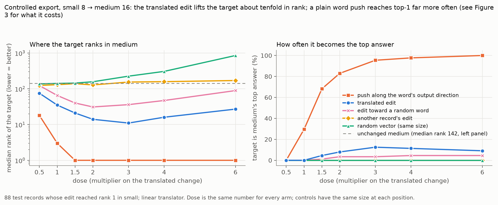
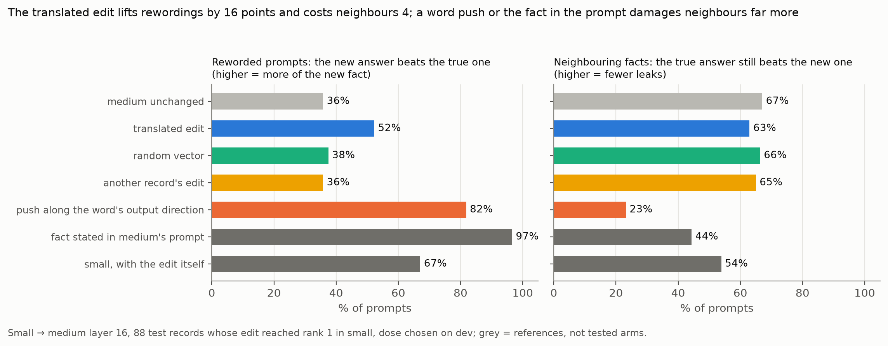
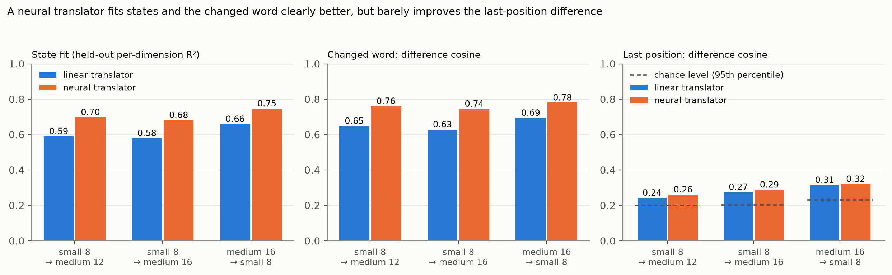
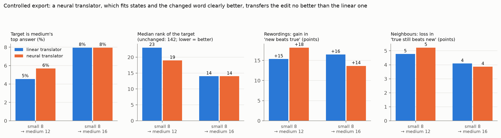

# Research Journal Entry 32: Cross-model transfer, part 2: controlled export of a gradient-descent edit, a neural translator, and the fact-or-word-push test

**Date:** October 10, 2026 (runs overnight, about 02:00 to 05:00)
**Branch:** `cross-model-transfer`
**Status:** The controlled export (linear and neural translator) is done on 150 test records and **fails the pre-set Gate 3**, with a clear graded effect (section 3.3). The neural translator fits better but transfers no better (sections 3.2, 3.5). Phase C (fact edit or word push, small alone) is done: the pre-stated rule gives "read-out steering", with caveats (section 3.6), and withdraws a statement of Entry 31. Import of real facts (phase E) and the Gemma replication are NOT done.
**Builds on:** Entry 31 (translators, country swap, 30-record pilot). **Plan:** `docs/cross_model_transfer/PLAN.md`. **Data pack:** `docs/Research_Journal/packs/cross_model_transfer/`. **Figures:** `docs/Research_Journal/images/e32_fig*.png|svg` (drawn by `tools/make_transfer_figures.py` from the pack only).

---

## 1. Why
Entry 31 showed a translator that carries "which country was named" well and the last-position summary weakly, and a 30-record pilot where a translated edit moved the target in medium but a plain push along the target word's own output direction moved it much more. The question for this entry: when the gradient-descent edit tuned in GPT-2 small is exported to GPT-2 medium on a proper benchmark, does medium (a) say the new fact, (b) say it on reworded prompts, (c) keep its other knowledge, and is that more than any control does? In the athlete picture: does the big player pick up the small player's trick and keep the rest of his game?

## 2. Method (new files only; older code untouched)
- **Benchmark (`src/transfer/benchmark.py`, `tools/transfer/05_export_edits.py`):** 200 CounterFact records with a counterfactual target (all targets in the project's CounterFact file are single tokens; checked on 3,000 records), 50 dev and 150 test, disjoint from the 100 ROME dev records and the 30 pilot records, neither model already answers with the target. Each record has the tuned prompt, 2 paraphrase prompts and 5 of its 10 neighbour prompts (other subjects with the same relation; the true target should stay preferred).
- **Edits:** the project's unchanged gradient-descent edit in small (200 candidates, 100 steps, all positions) toward the counterfactual target, and a second edit toward a **random word whose rank on the prompt in small is within 0.7x to 1.4x of the target's** (control). Only the multipliers are stored; the change they make at any prompt is recomputed (`sum_k a_k act_k W_dec[k]`), which is how the same edit is re-applied to reworded prompts ("relay mode"). The start-of-text position is left out of the injected change (ablation: included; no difference).
- **Export (`tools/transfer/06_export_eval.py`):** the change at small layer 8 is translated (linear map from Entry 31, or the neural map) and added to medium at layer 12 or 16 on the same prompt, times a dose. Dose: chosen on the 50 dev records whose edit reached rank 1 in small (doses 0.5 to 6), reported on test; plus one **norm-matched** dose chosen without looking at any outcome (the injected change is as large relative to medium's residual norm as the edit was relative to small's).
- **Arms (same size at each position unless stated):** translated edit; random vector; **wrong recipe** (another record's edit re-applied to this prompt); **word push** (medium's own output direction of the target at the last position); **random-word edit** (judged on its own word); reference rows: medium unchanged, medium with the fact stated in its prompt, small with the edit itself, small unchanged.
- **Measures:** top-1 (the target is the top answer), rank of the target (each word against its own starting rank), PS (P(new) > P(true) on the 2 paraphrases), NS (P(true) > P(new) on the 5 neighbours; higher = fewer leaks), KL and top-1 flips on the 12 unrelated prompts against the unchanged model. Primary population: the 88 test records (of 150) whose edit reached rank 1 in small; all 150 are also reported.
- **Gate 3** (written in the plan before the run; the author had not yet confirmed the numbers and I treated the proposal as final): (a) top-1 at the dev dose at least 15%; (b) at least 10 points above the strongest of random / wrong-recipe / random-word controls, each at its own best dose on test; (c) paired Wilcoxon on the rank gain, p < 0.01. Rewordings, neighbours and unrelated prompts are reported, not gated.
- **Neural translator (`src/transfer/mlp_maps.py`, `tools/transfer/07_fit_mlp_maps.py`):** `f(x) = linear map + sigma_y * MLP(x)` with one hidden layer of 2,048 and a zero-initialised output, so training starts exactly at the linear translator; 400,000 wikitext-2 tokens, 12 epochs, early stopping on half A of the held-out text, numbers on half B. The translated change of an edit is `f(h + delta) - f(h)`.

## 3. Results
### 3.1 The edits in small
Real edit reaches rank 1 on 116 of 200 records (58%); the rank-matched random-word edit on 87 of 200 (44%). On the 150 test records the edit gives top-1 59% and "new beats true" 89% in small itself (unchanged small: PS 33%, NS 71%; on the 88 successful records: with the edit PS 67%, NS 54%; unchanged PS 40%, NS 63%).

### 3.2 Neural against linear translator (held-out text, `packs/.../mlp_vs_linear.json`, Figure 4)
| pair | per-dim R-squared linear / neural | stitching recovered | difference cosine at the changed word | at the last position (chance 95th pct) |
|---|---|---|---|---|
| small 8 to medium 12 | 0.590 / 0.698 | 0.947 / 0.968 | 0.648 / 0.760 | 0.242 / 0.260 (0.199 / 0.214) |
| small 8 to medium 16 | 0.579 / 0.681 | 0.906 / 0.936 | 0.628 / 0.745 | 0.275 / 0.288 (0.202 / 0.219) |
| medium 16 to small 8 | 0.659 / 0.747 | 0.984 / 0.999 | 0.694 / 0.780 | 0.314 / 0.320 (0.229 / 0.242) |

The network fits states (+0.09 to +0.11 R-squared) and the changed word's identity (+0.09 to +0.12 cosine) clearly better; the last-position difference, the weak part, barely moves (+0.006 to +0.018) and its chance level rises by about as much. Capacity does not fix the weak part.

### 3.3 Controlled export, linear translator (88 test records whose edit reached rank 1 in small; `packs/.../d_analysis_linear.json`, Figures 2 and 3)
| | small 8 to medium 12 (dose 1.5) | small 8 to medium 16 (dose 2.0) |
|---|---|---|
| medium unchanged: median rank of the target / PS / NS | 142 / 36% / 67% | same |
| **translated edit: top-1 / median rank / PS / NS** | **5% / 23 / 51% / 62%** | **8% / 14 / 52% / 63%** |
| random vector | 0% / 137 / 36% / 66% | 0% / 157 / 38% / 66% |
| another record's edit | 0% / 132 / 35% / 67% | 0% / 128 / 36% / 65% |
| random-word edit (own word) | 0% / 53 / - / - | 3% / 31 / - / - |
| word push | 10% / 6 / 55% / 49% (97% top-1 at dose 6) | 83% / 1 / 82% / 23% |
| fact stated in medium's prompt | PS 97%, NS 44% | same |
| small with the edit itself | PS 67%, NS 54% | same |
| unrelated prompts, translated at the dev dose: KL / top-1 flips (random vector; another record's edit) | 0.018 / 6% (0.005 / 3%; 0.015 / 7%) | 0.032 / 11% (0.010 / 4%; 0.031 / 12%) |
| norm-matched dose (no tuning): top-1 / PS / NS | 5% / 55% / 62% | 6% / 51% / 65% |

Paired tests over the 88 records: the translated edit's rank gain beats the random vector and the wrong recipe (p < 1e-12) and the rank-matched random-word edit (each word against its own start rank; p = 2.7e-3 and 2.1e-3); its paraphrase lift (+15 and +16 points over unchanged medium) beats random and wrong-recipe (p < 1e-4); transfer efficiency (lift in medium divided by lift of the edit in small itself) 0.57 and 0.62; it keeps neighbours far better than the word push (p < 1e-8; the push loses 18 and 44 points). On all 150 test records the effects are smaller (top-1 3% and 5%, paraphrase lift +11 points).

**Gate 3: FAIL.** (a) top-1 5% and 8% against the required 15%: no. (b) The strongest control, the random-word edit at its best dose, reaches 5% top-1, so the margin is 0 and 3 points against the required 10: no. (c) holds (paired p well below 0.01). The dose is not driving this: the norm-matched dose agrees with the dev-chosen one.

### 3.4 What the graded numbers say (not a gate)
The transferred edit is a real, specific, but weak version of the source edit. The target's rank in medium improves about 6 to 10 times (142 to 23 and to 14), the "new beats true" test on rewordings rises 15 to 16 points (about 60% of what the edit does inside small), neighbours lose 4 to 5 points (the edit costs small 9 points in small itself), and it makes the target the top answer in only 5 to 8% of records. A plain word push makes it the top answer in most records but destroys neighbours (NS 23% at layer 16) and stating the fact in the prompt moves rewordings to 97% but also costs neighbours 23 points. Disturbance of unrelated prompts is not specific to the edit: another record's edit at the same size disturbs them as much (KL 0.031 against 0.032). A plausible counterfactual target gains more than a rank-matched random word (mean log-rank gain 2.04 against 1.49 at layer 16; top-1 8% against 3%), a modest sign that the target matters.

### 3.5 Controlled export, neural translator (`packs/.../d_analysis_mlp.json`, Figure 6)
Small 8 to medium 12 (dose 1.5 chosen on dev): top-1 6%, median rank 19, PS +18 points (54%), NS 62%. Small 8 to medium 16 (dose 1.5): top-1 8%, median rank 14, PS +14 points (49%), NS 63%. Gate 3 FAIL again (a) 6%, 8%; (b) strongest control 6% (margins 0 and 2). Linear: top-1 5% and 8%, median rank 23 and 14, PS lift +15 and +16. **The better translator does not export the edit better**, although it fits the subject's representation (cosine at the changed word 0.63 to 0.75) clearly better. The limit is not the translator's capacity.

### 3.6 Phase C: fact edit or word push? (GPT-2 small alone)
(`tools/transfer/08_fact_or_push.py`, `src/gradient_editing_masked.py`; the 150 test records; `packs/.../c_fact_or_push*.json`, Figure 5.) Four edit variants, each re-applied (same multipliers on the prompt's own activations) to the tuned prompt, its 2 paraphrases and 5 neighbours inside small: the existing edit (all positions); a new edit that may only change the **subject's tokens**; one that may only change the **last position**; the edit toward a rank-matched random word. "PS", "NS" and gains are over the records where that variant's edit reached rank 1 on the tuned prompt.

| variant | edit reaches rank 1 | PS (rewordings: new beats true) | NS (neighbours: true still beats new) | rewordings: mean log-rank gain | carry (rewordings gain / tuned-prompt gain) |
|---|---|---|---|---|---|
| all positions | 59% (88 of 150) | 67% | 54% | 1.20 | 0.26 |
| subject tokens only | **12%** (18 of 150) | 81% | 49% | 0.75 | 0.34 |
| last position only | **7%** (10 of 150) | 65% | 34% | 0.23 | 0.02 |
| random word, all positions | 45% (67 of 150) | 51% | 61% | 0.77 | 0.15 |
| unedited small | | 33% | 71% | | |

- Real counterfactual target against the rank-matched random word, rewordings gain (58 records where both edits succeeded): 1.04 against 0.82, paired Wilcoxon (real greater) **p = 0.032**, not below the pre-set 0.01.
- Direction of the edit's change at the last position against the target word's own output direction: median cosine 0.051 (91.9th percentile among all words), median logit-lens rank of the target **4,922** (random-word edit: cosine 0.029, rank 12,605). The edit is **not** dominated by the target's output direction.
- **Pre-stated rule (plan, written before the run), applied as written:** rewordings gain above the random word's at p < 0.01: no; subject-only keeps at least half of the all-position effect (success rate and rewordings gain): no (12% against 59%); change dominated by the target's output direction (lens rank 10 or better): no. The rule's outcome is **READ-OUT STEERING**, which follows from the first criterion not being met (p = 0.032, not 0.01); "association-like" is rejected by two criteria.
- **Reading, with the caveats:** (1) There is no evidence here that the edit is an association edit by the pre-stated criteria. (2) It is also not a pure push along the target's output direction (cosine 0.05, lens rank 4,922). (3) The all-positions edit carries to rewordings more than the random-word edit (PS 67% against 51%, carry 0.26 against 0.15, p = 0.03), a modest sign that the target matters. (4) Restricted to the subject's tokens the edit mostly fails (12%), but where it succeeds it carries to rewordings strongly (81%); restricted to the last position it mostly fails (7%) and does not carry (carry 0.02): a last-position edit is a read-out edit. (5) The masked edits are optimised with the same 100 steps, so their low success may partly reflect the optimiser's reach and not the model; the subject-only and last-only groups have 18 and 10 records, so their numbers are rough. The label "read-out steering" should be read as "not shown to be an association edit", not as proof of a plain word push.
- **Correction of Entry 31 (section 3.5) and the plan:** the pilot found 89% of the edit's squared size at positions between the start token and the last token and I called this "mainly a change of the subject's representation". Those positions include the **relation words** as well as the subject, and restricting the edit to the subject's tokens alone rarely works (12%). The statement is withdrawn; what holds is only that the change sits away from the last position.

## 4. Pre-stated rules and verdicts
- Gate 3 (this entry, section 3.3): **FAIL** for both translators and both layers on (a) and (b); (c) and the dose check hold.
- H24 reading (plan, Phase C): **read-out steering**, as the rule is written (rewordings gain not above the random word's at p < 0.01; subject-only edit keeps 12% of the 59% success), with the caveats of section 3.6; the edit is not dominated by the target's output direction.

## 5. Mistakes and corrections (so they are not repeated)
1. **The random-word control's rank gain was measured against the counterfactual target's starting rank, not its own** in the first printed run of `06_export_eval.py` (gate part (c) and the "plausible against random" line). The top-1 rates and the verdict do not depend on it. Fixed in the tool; every number in this entry comes from `tools/transfer/09_analyse_export.py`, which measures each word against its own start rank for both translators.
2. **Background time limits again:** the overnight queue script had a 2-hour limit and was stopped while the neural export was running; the Python job survived, I re-queued Phase C behind it with a marker taken from the job's own last line.
3. **A patch script's double backslashes were halved by the command harness** (known gotcha in the handoff) and broke a figure script; repaired with the file editor.
4. A 100% single-token rate for CounterFact targets looked suspicious; checked directly (3,000 records, all single tokens); this file was pre-filtered.
5. **An over-claim of Entry 31 withdrawn:** "the multiplier edit is mainly a change of the subject's representation" (from the position of its change in the pilot). Phase C shows an edit restricted to the subject's tokens rarely succeeds (section 3.6).

## 6. What this does and does not show
- Shown: exporting the gradient-descent edit from small to medium through a translator fitted only on ordinary text moves medium toward the new fact specifically (far above random, wrong-recipe and rank-matched controls, same result with an outcome-free dose), carries to reworded prompts, and costs neighbouring facts little; it makes the new fact the top answer only rarely, so it does not pass the pre-set Gate 3. The neural translator, though a better fit, changes nothing. A word push or the fact in the prompt is far stronger at the target and far less specific.
- NOT shown: that the benefits of the larger model are fully kept (text quality over generated continuations, many unrelated prompts and other relations were not measured; 12 unrelated prompts only); that the effect is a fact edit rather than a weaker push (Phase C only addresses it for small); any Import of real facts; any other model pair.
- Limits: one model pair, two target layers, the multiplier edit only (the additive edit was not exported; B1 predicts it transfers worse); 150 test records; records share relations; the dose grid stops at 6; Gate 3's numbers were proposed after a 30-record pilot.

## 7. What could be tried next (not decided)
1. Fit the translator on **edit differences** (pairs of an edit's effect in small and medium's own response to the same edit, for example ROME on medium, whose hyper-parameters exist), or with an **output-matching loss** (train it so that medium's predictions move as small's do), instead of squared error on ordinary text.
2. Inject at several layers at once or later layers; export a different edit form (subject-only edits, if Phase C says that is where the effect lives).
3. Import of real facts (phase E), which uses the better map direction (medium to small).
4. The replication on Gemma 3 270M and 1B.

## 8. Reproduce
From the repository root with `.venv\Scripts\python.exe`: `tools/transfer/05_export_edits.py` (benchmark and 200 x 2 edits, 1,263 s), `tools/transfer/07_fit_mlp_maps.py` (380 s), `tools/transfer/06_export_eval.py` and `... --translator mlp` (about 54 min each), `tools/transfer/09_analyse_export.py [--translator mlp]` (seconds, writes the paired analysis), `tools/transfer/08_fact_or_push.py` (Phase C), `tools/make_transfer_figures.py`. RTX 4050 laptop GPU, 6 GB. Per-record numbers are in `outputs/transfer/d_eval_*.pt` (local, 80 MB each); the committed pack holds the summaries.

## 9. Figures
`e32_fig1_country_swap` (Entry 31's B1 by layer pair), `e32_fig2_dose_curves` (rank and top-1 against dose, translated edit and controls), `e32_fig3_rewordings_neighbours` (rewordings and neighbours against controls and references), `e32_fig4_neural_vs_linear`, `e32_fig5_fact_or_push` (Phase C), `e32_fig6_export_linear_vs_neural`.

