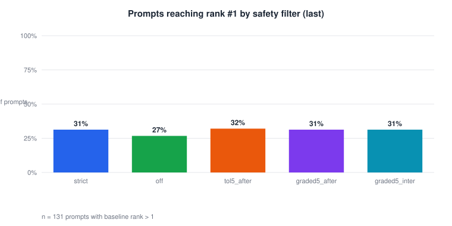
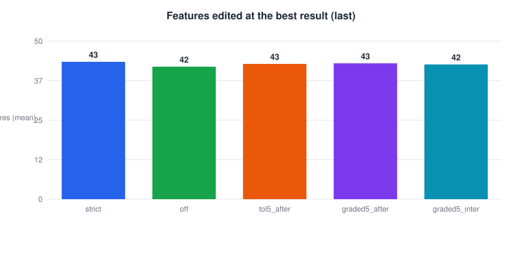
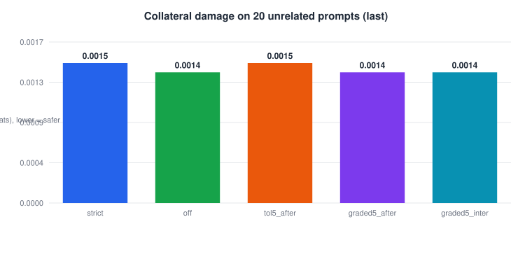
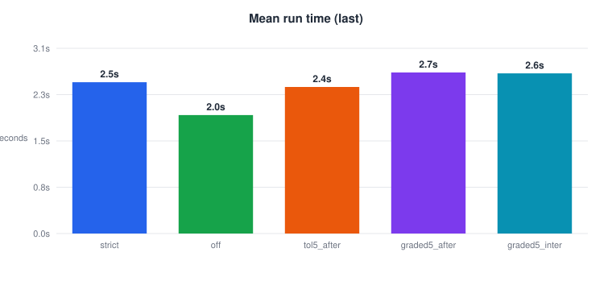
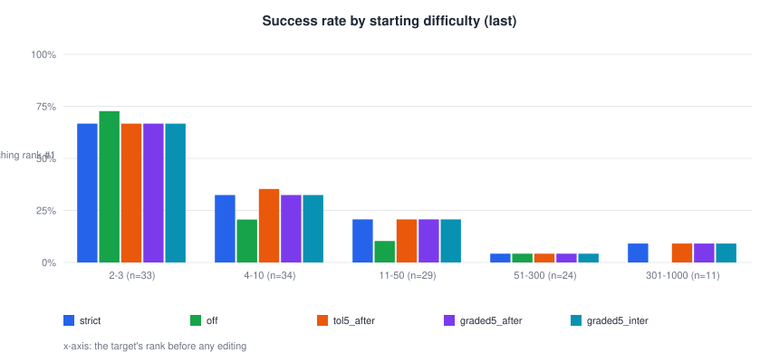
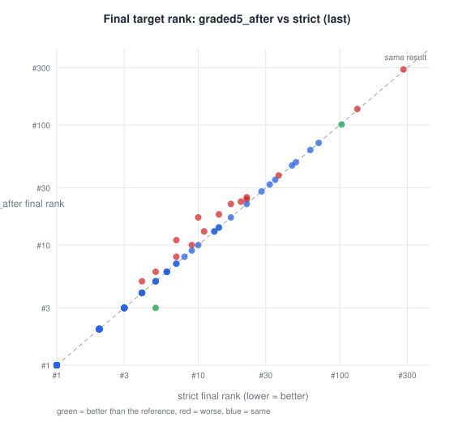
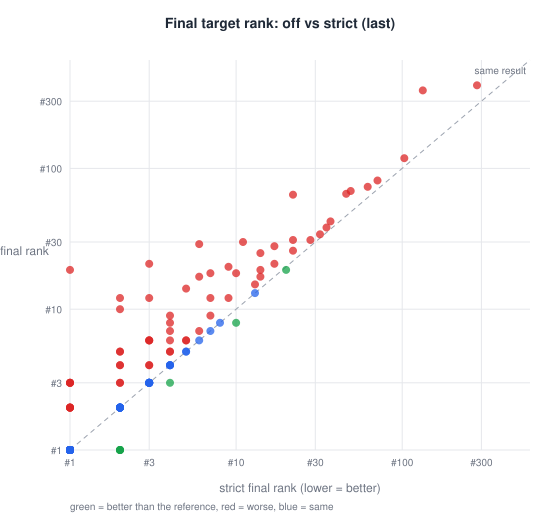
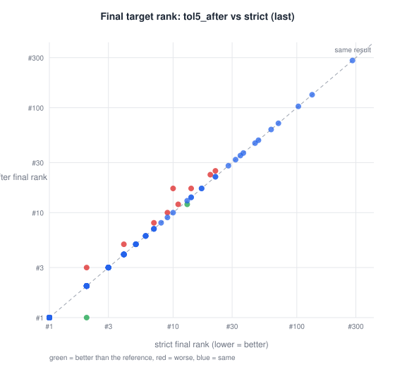
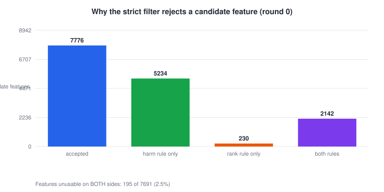

# Research Journal Entry 21 (DRAFT): Dynamic safety filtering - Safety filter study - FULL (last token only)

**Status:** FINAL  
**Generated:** 2026-09-26 18:40:26 from `safety_filter_spec_full_last.json` (pack `entry21_full_last_20260926_1840`)  
**Code commit:** `3f9b18a`  
**Model / layer:** GPT-2 small, layer 8 (`blocks.8.hook_resid_pre`), cuda

---


## 1. Question

Does relaxing the strict safety filter (tolerance or graded per-feature strength) raise the share of prompts whose target token reaches rank #1, without extra collateral damage? _(edit if the framing changed)_

## 2. Method

- Prompts: 156 in the spec; 131 comparable (target not already rank #1) per arm and mode.
- Modes: last.
- Default settings: `{"mute_strength": 0.6, "boost_strength": 0.5, "top_n": 120, "cumulative_sweep": true, "pool_refill": true, "max_refill_rounds": 0, "stop_on_rank1": true, "use_batched": true, "safety_filter": true, "max_steps": 250, "collateral": true, "combination_check": false, "record_detail": "compact"}`
- Arms compared on identical prompts:
- **strict**: `{"safety_mode": "strict"}`
- **off**: `{"safety_filter": false}`
- **tol5_after**: `{"safety_mode": "tolerance", "tolerance": 0.05, "rescued_order": "after"}`
- **graded5_after**: `{"safety_mode": "graded", "tolerance": 0.05, "rescued_order": "after"}`
- **graded5_inter**: `{"safety_mode": "graded", "tolerance": 0.05, "rescued_order": "interleaved"}`
- Reference arm: `strict`. Collateral damage = mean KL(clean || edited) on 20 unrelated prompts.

## 3.1 Results, last mode

| Arm | Prompts | Reached rank #1 | Success rate % | Mean rank gain | Median final rank | Mean final prob % | Features at best | Rescued in best | Steps | Time s | Collateral KL (nats) | Top-1 flips |
|---|---|---|---|---|---|---|---|---|---|---|---|---|
| strict | 131 | 41 | 31.3 | 62.9084 | 3 | 7.0076 | 43.1679 | 0.0 | 26.5878 | 2.4956 | 0.0015 | 0.0267 |
| off | 131 | 35 | 26.7 | 57.3588 | 3 | 5.7306 | 41.6336 | 0.0 | 25.8397 | 1.9539 | 0.0014 | 0.023 |
| tol5_after | 131 | 42 | 32.1 | 62.7634 | 3 | 6.9559 | 42.5191 | 0.4122 | 26.313 | 2.4165 | 0.0015 | 0.0271 |
| graded5_after | 131 | 41 | 31.3 | 62.5878 | 3 | 6.9395 | 42.687 | 0.7557 | 26.3282 | 2.6557 | 0.0014 | 0.0267 |
| graded5_inter | 131 | 41 | 31.3 | 62.5725 | 3 | 6.8679 | 42.3435 | 1.1145 | 26.3893 | 2.6405 | 0.0014 | 0.0258 |

| Arm | Reference | Prompts | Better | Worse | Same | Newly rank #1 | Lost rank #1 | Sign-test p | McNemar p |
|---|---|---|---|---|---|---|---|---|---|
| off | strict | 131 | 7 | 64 | 60 | 4 | 10 | 1.2596743309903347e-12 | 0.1795654296875 |
| tol5_after | strict | 131 | 2 | 9 | 120 | 1 | 0 | 0.0654296875 | 1.0 |
| graded5_after | strict | 131 | 2 | 15 | 114 | 0 | 0 | 0.002349853515625 |  |
| graded5_inter | strict | 131 | 3 | 13 | 115 | 0 | 0 | 0.021270751953125 |  |



*Fig01. Share of prompts whose target token reached rank #1, per safety-filter variant, last-token-only candidate source (n = 131 prompts whose target did not start at rank #1).*



*Fig02. Mean number of SAE features muted or boosted at the best result found, per variant, last-token-only candidate source (n = 131).*



*Fig03. Mean KL divergence (nats) between the clean and edited next-token distributions on 20 unrelated prompts, per variant, last-token-only candidate source. Lower means less collateral change.*



*Fig04. Mean model-compute time per run in seconds, per variant, last-token-only candidate source (n = 131).*



*Fig05. Share of prompts reaching rank #1 per safety-filter variant, grouped by how far down the target started (baseline rank bins), last mode.*



*Fig06. Final target rank per prompt under 'graded5_after' against the reference 'strict', last-token-only candidate source, log scale. Points below the dashed diagonal are better than the reference; each dot is one prompt (n = 131).*


*Fig07. Final target rank per prompt under 'graded5_inter' against the reference 'strict', last-token-only candidate source, log scale. Points below the dashed diagonal are better than the reference; each dot is one prompt (n = 131).*



*Fig08. Final target rank per prompt under 'off' against the reference 'strict', last-token-only candidate source, log scale. Points below the dashed diagonal are better than the reference; each dot is one prompt (n = 131).*



*Fig09. Final target rank per prompt under 'tol5_after' against the reference 'strict', last-token-only candidate source, log scale. Points below the dashed diagonal are better than the reference; each dot is one prompt (n = 131).*

## 4. Why the strict filter rejects features



*Fig10. Verdicts of the strict safety filter on every round-0 candidate feature (mute and boost sides pooled) in the reference arm. Only 195 of 7691 features (2.5%) were unusable on both sides.*

## 5. Interpretation

_TO BE WRITTEN after the results are reviewed._ State which arms beat the reference (sign / McNemar p-values above), the cost in features/steps/time, and the collateral-damage comparison.

## 6. Limitations

- GPT-2 small, one layer, prompts not drawn at random.
- Success = rank #1 on the next token only.
- _(add any new caveats)_

## 7. Reproduction

```
python tools/make_paper_pack.py outputs/safety_batches/safety_filter_spec_full_last.json --entry 21
```
Or: Batch tab -> select the result -> Build paper pack. Full provenance in `MANIFEST.json`.
