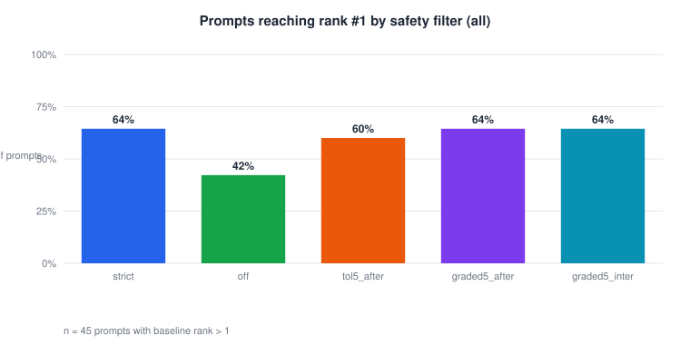
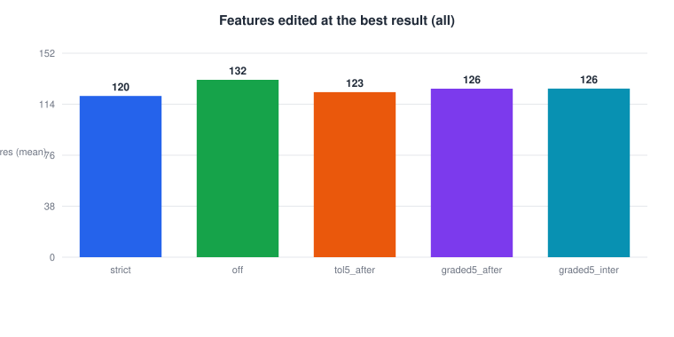
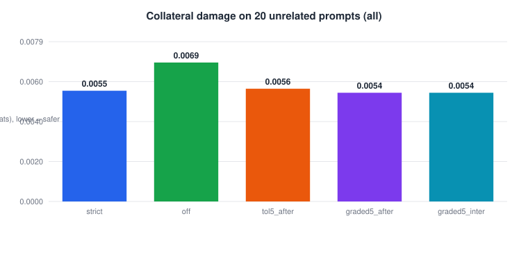
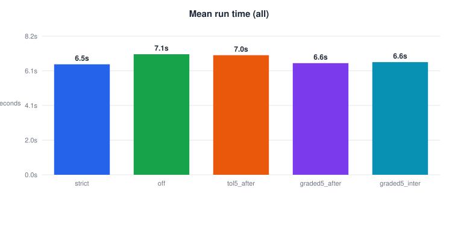
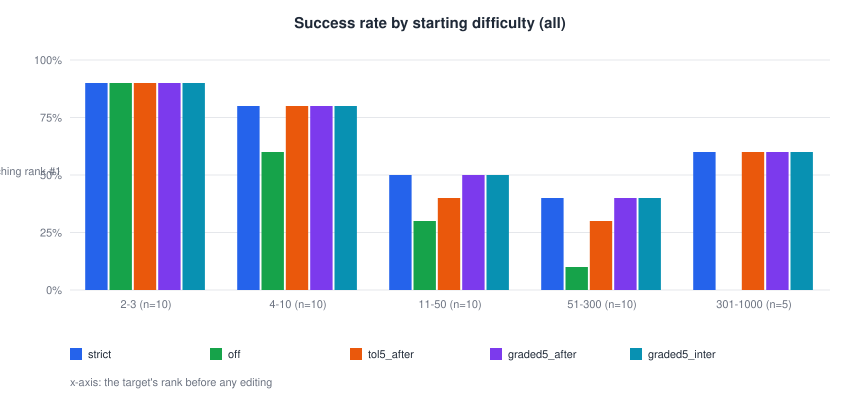
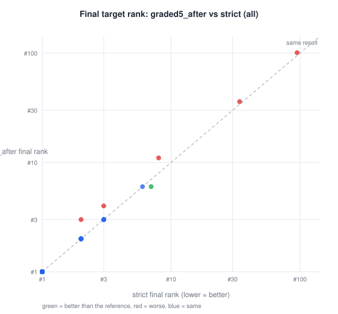
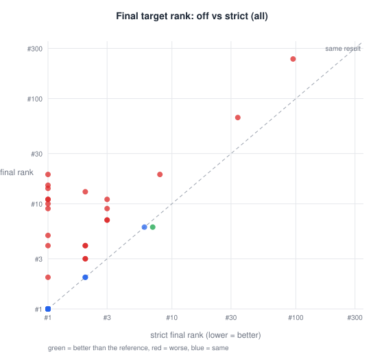
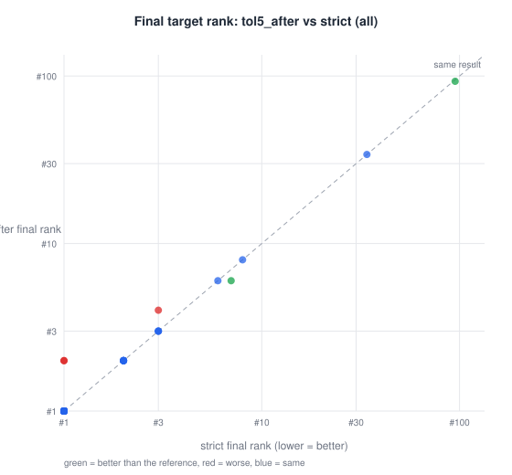
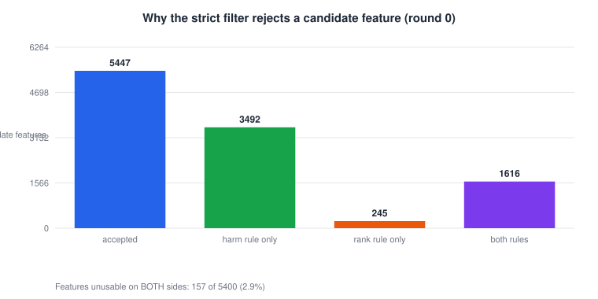

# Research Journal Entry 21 (DRAFT): Dynamic safety filtering - Safety filter study - PILOT (all prompt positions)

**Status:** FINAL  
**Generated:** 2026-09-26 18:12:29 from `safety_filter_spec_pilot.json` (pack `entry21_pilot_20260926_1812`)  
**Code commit:** `a9e6302` (+ uncommitted changes)  
**Model / layer:** GPT-2 small, layer 8 (`blocks.8.hook_resid_pre`), cuda

---


## 1. Question

Does relaxing the strict safety filter (tolerance or graded per-feature strength) raise the share of prompts whose target token reaches rank #1, without extra collateral damage? _(edit if the framing changed)_

## 2. Method

- Prompts: 50 in the spec; 45 comparable (target not already rank #1) per arm and mode.
- Modes: all.
- Default settings: `{"mute_strength": 0.6, "boost_strength": 0.5, "top_n": 120, "cumulative_sweep": true, "pool_refill": true, "max_refill_rounds": 0, "stop_on_rank1": true, "use_batched": true, "safety_filter": true, "max_steps": 250, "collateral": true, "combination_check": false, "record_detail": "compact"}`
- Arms compared on identical prompts:
- **strict**: `{"safety_mode": "strict"}`
- **off**: `{"safety_filter": false}`
- **tol5_after**: `{"safety_mode": "tolerance", "tolerance": 0.05, "rescued_order": "after"}`
- **graded5_after**: `{"safety_mode": "graded", "tolerance": 0.05, "rescued_order": "after"}`
- **graded5_inter**: `{"safety_mode": "graded", "tolerance": 0.05, "rescued_order": "interleaved"}`
- Reference arm: `strict`. Collateral damage = mean KL(clean || edited) on 20 unrelated prompts.

## 3.1 Results, all mode

| Arm | Prompts | Reached rank #1 | Success rate % | Mean rank gain | Median final rank | Mean final prob % | Features at best | Rescued in best | Steps | Time s | Collateral KL (nats) | Top-1 flips |
|---|---|---|---|---|---|---|---|---|---|---|---|---|
| strict | 45 | 29 | 64.4 | 89.5778 | 1 | 8.5598 | 120.4222 | 0.0 | 68.0222 | 6.508 | 0.0055 | 0.0522 |
| off | 45 | 19 | 42.2 | 82.6 | 3 | 5.6166 | 132.4889 | 0.0 | 89.5556 | 7.1019 | 0.0069 | 0.0545 |
| tol5_after | 45 | 27 | 60.0 | 89.5778 | 1 | 8.4406 | 123.2667 | 1.1778 | 74.1333 | 7.0435 | 0.0056 | 0.0544 |
| graded5_after | 45 | 29 | 64.4 | 89.3111 | 1 | 8.2999 | 125.8667 | 2.5333 | 70.8 | 6.5756 | 0.0054 | 0.0511 |
| graded5_inter | 45 | 29 | 64.4 | 89.3111 | 1 | 8.3879 | 125.9333 | 2.9778 | 70.8444 | 6.637 | 0.0054 | 0.0511 |

| Arm | Reference | Prompts | Better | Worse | Same | Newly rank #1 | Lost rank #1 | Sign-test p | McNemar p |
|---|---|---|---|---|---|---|---|---|---|
| off | strict | 45 | 1 | 22 | 22 | 0 | 10 | 5.7220458984375e-06 | 0.001953125 |
| tol5_after | strict | 45 | 2 | 3 | 40 | 0 | 2 | 1.0 | 0.5 |
| graded5_after | strict | 45 | 1 | 5 | 39 | 0 | 0 | 0.21875 |  |
| graded5_inter | strict | 45 | 1 | 5 | 39 | 0 | 0 | 0.21875 |  |



*Fig01. Share of prompts whose target token reached rank #1, per safety-filter variant, all-prompt-positions candidate source (n = 45 prompts whose target did not start at rank #1).*



*Fig02. Mean number of SAE features muted or boosted at the best result found, per variant, all-prompt-positions candidate source (n = 45).*



*Fig03. Mean KL divergence (nats) between the clean and edited next-token distributions on 20 unrelated prompts, per variant, all-prompt-positions candidate source. Lower means less collateral change.*



*Fig04. Mean model-compute time per run in seconds, per variant, all-prompt-positions candidate source (n = 45).*



*Fig05. Share of prompts reaching rank #1 per safety-filter variant, grouped by how far down the target started (baseline rank bins), all mode.*



*Fig06. Final target rank per prompt under 'graded5_after' against the reference 'strict', all-prompt-positions candidate source, log scale. Points below the dashed diagonal are better than the reference; each dot is one prompt (n = 45).*


*Fig07. Final target rank per prompt under 'graded5_inter' against the reference 'strict', all-prompt-positions candidate source, log scale. Points below the dashed diagonal are better than the reference; each dot is one prompt (n = 45).*



*Fig08. Final target rank per prompt under 'off' against the reference 'strict', all-prompt-positions candidate source, log scale. Points below the dashed diagonal are better than the reference; each dot is one prompt (n = 45).*



*Fig09. Final target rank per prompt under 'tol5_after' against the reference 'strict', all-prompt-positions candidate source, log scale. Points below the dashed diagonal are better than the reference; each dot is one prompt (n = 45).*

## 4. Why the strict filter rejects features



*Fig10. Verdicts of the strict safety filter on every round-0 candidate feature (mute and boost sides pooled) in the reference arm. Only 157 of 5400 features (2.9%) were unusable on both sides.*

## 5. Interpretation

_TO BE WRITTEN after the results are reviewed._ State which arms beat the reference (sign / McNemar p-values above), the cost in features/steps/time, and the collateral-damage comparison.

## 6. Limitations

- GPT-2 small, one layer, prompts not drawn at random.
- Success = rank #1 on the next token only.
- _(add any new caveats)_

## 7. Reproduction

```
python tools/make_paper_pack.py outputs/safety_batches/safety_filter_spec_pilot.json --entry 21
```
Or: Batch tab -> select the result -> Build paper pack. Full provenance in `MANIFEST.json`.
