# Research Journal Entry 21 (DRAFT): Dynamic safety filtering - Safety filter study - QUICK CHECK (sanity test, a few minutes)

**Status:** PRELIMINARY  
**Generated:** 2026-09-26 17:01:00 from `safety_filter_spec_quick.json` (pack `entry21_quick_check_20260926_1700`)  
**Code commit:** `a9e6302` (+ uncommitted changes)  
**Model / layer:** GPT-2 small, layer 8 (`blocks.8.hook_resid_pre`), cuda

---

> **PRELIMINARY - do not cite.** Too few comparable prompts (or errors) for publication-grade claims.


## 1. Question

Does relaxing the strict safety filter (tolerance or graded per-feature strength) raise the share of prompts whose target token reaches rank #1, without extra collateral damage? _(edit if the framing changed)_

## 2. Method

- Prompts: 8 in the spec; 6 comparable (target not already rank #1) per arm and mode.
- Modes: all, last.
- Default settings: `{"mute_strength": 0.6, "boost_strength": 0.5, "top_n": 120, "cumulative_sweep": true, "pool_refill": true, "max_refill_rounds": 0, "stop_on_rank1": true, "use_batched": true, "safety_filter": true, "max_steps": 250, "collateral": true, "combination_check": false, "record_detail": "compact"}`
- Arms compared on identical prompts:
- **strict**: `{"safety_mode": "strict"}`
- **off**: `{"safety_filter": false}`
- **tol5_after**: `{"safety_mode": "tolerance", "tolerance": 0.05, "rescued_order": "after"}`
- **graded5_after**: `{"safety_mode": "graded", "tolerance": 0.05, "rescued_order": "after"}`
- **graded5_inter**: `{"safety_mode": "graded", "tolerance": 0.05, "rescued_order": "interleaved"}`
- Reference arm: `strict`. Collateral damage = mean KL(clean || edited) on 20 unrelated prompts.

## 3.1 Results, all mode

| Arm | Prompts | Reached rank #1 | Success rate % | Mean rank gain | Median final rank | Mean final prob % | Features at best | Rescued in best | Steps | Time s | Collateral KL (nats) | Top-1 flips |
|---|---|---|---|---|---|---|---|---|---|---|---|---|
| strict | 6 | 5 | 83.3 | 3.1667 | 1 | 10.565 | 39.0 | 0.0 | 20.5 | 2.416 | 0.0017 | 0.0167 |
| off | 6 | 4 | 66.7 | 2.6667 | 1 | 8.4439 | 51.6667 | 0.0 | 45.3333 | 3.1642 | 0.0029 | 0.0333 |
| tol5_after | 6 | 5 | 83.3 | 3.1667 | 1 | 10.5247 | 36.6667 | 0.0 | 20.6667 | 2.2105 | 0.0015 | 0.0167 |
| graded5_after | 6 | 5 | 83.3 | 3.1667 | 1 | 10.5247 | 36.6667 | 0.0 | 20.6667 | 2.2532 | 0.0015 | 0.0167 |
| graded5_inter | 6 | 5 | 83.3 | 3.1667 | 1 | 10.4855 | 38.3333 | 0.5 | 20.6667 | 2.3933 | 0.0016 | 0.0167 |

| Arm | Reference | Prompts | Better | Worse | Same | Newly rank #1 | Lost rank #1 | Sign-test p | McNemar p |
|---|---|---|---|---|---|---|---|---|---|
| off | strict | 6 | 0 | 2 | 4 | 0 | 1 | 0.5 | 1.0 |
| tol5_after | strict | 6 | 0 | 0 | 6 | 0 | 0 |  |  |
| graded5_after | strict | 6 | 0 | 0 | 6 | 0 | 0 |  |  |
| graded5_inter | strict | 6 | 0 | 0 | 6 | 0 | 0 |  |  |

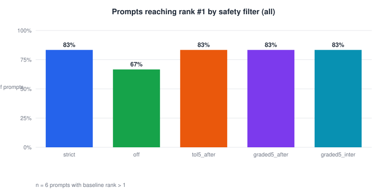

*Fig01. Share of prompts whose target token reached rank #1, per safety-filter variant, all-prompt-positions candidate source (n = 6 prompts whose target did not start at rank #1).*

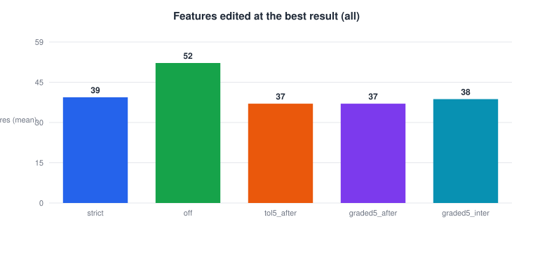

*Fig02. Mean number of SAE features muted or boosted at the best result found, per variant, all-prompt-positions candidate source (n = 6).*

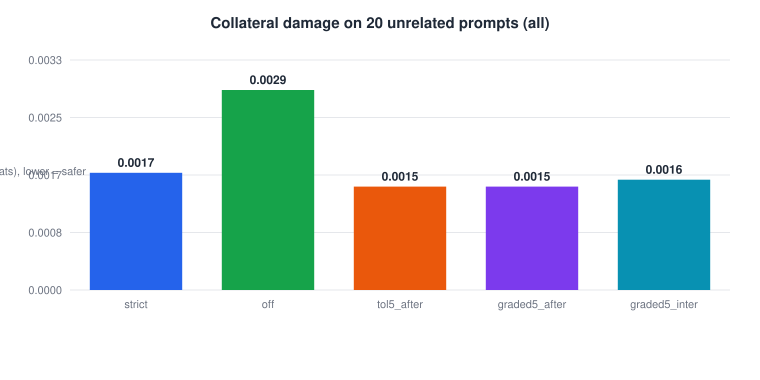

*Fig03. Mean KL divergence (nats) between the clean and edited next-token distributions on 20 unrelated prompts, per variant, all-prompt-positions candidate source. Lower means less collateral change.*

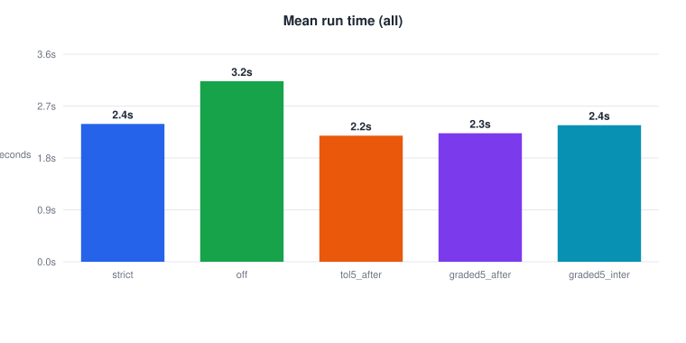

*Fig04. Mean model-compute time per run in seconds, per variant, all-prompt-positions candidate source (n = 6).*

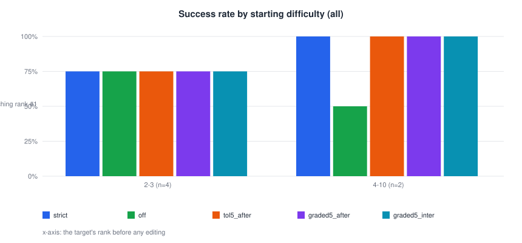

*Fig05. Share of prompts reaching rank #1 per safety-filter variant, grouped by how far down the target started (baseline rank bins), all mode.*


*Fig06. Final target rank per prompt under 'graded5_after' against the reference 'strict', all-prompt-positions candidate source, log scale. Points below the dashed diagonal are better than the reference; each dot is one prompt (n = 6).*

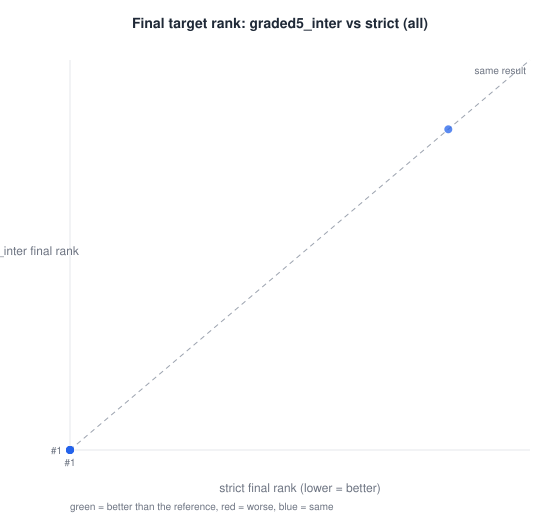

*Fig07. Final target rank per prompt under 'graded5_inter' against the reference 'strict', all-prompt-positions candidate source, log scale. Points below the dashed diagonal are better than the reference; each dot is one prompt (n = 6).*

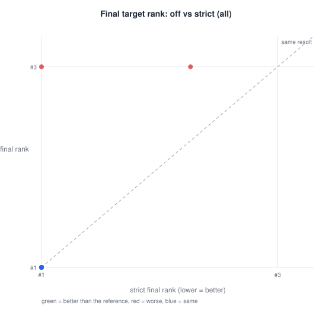

*Fig08. Final target rank per prompt under 'off' against the reference 'strict', all-prompt-positions candidate source, log scale. Points below the dashed diagonal are better than the reference; each dot is one prompt (n = 6).*

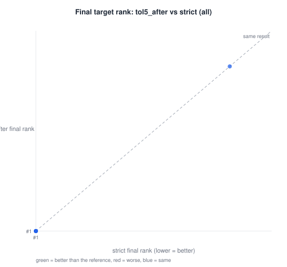

*Fig09. Final target rank per prompt under 'tol5_after' against the reference 'strict', all-prompt-positions candidate source, log scale. Points below the dashed diagonal are better than the reference; each dot is one prompt (n = 6).*

## 3.2 Results, last mode

| Arm | Prompts | Reached rank #1 | Success rate % | Mean rank gain | Median final rank | Mean final prob % | Features at best | Rescued in best | Steps | Time s | Collateral KL (nats) | Top-1 flips |
|---|---|---|---|---|---|---|---|---|---|---|---|---|
| strict | 6 | 2 | 33.3 | 2.3333 | 2 | 9.5679 | 38.6667 | 0.0 | 21.8333 | 1.7402 | 0.0015 | 0.025 |
| off | 6 | 1 | 16.7 | 2.1667 | 2 | 7.349 | 44.3333 | 0.0 | 25.1667 | 1.6367 | 0.0013 | 0.0167 |
| tol5_after | 6 | 2 | 33.3 | 2.3333 | 2 | 9.562 | 38.1667 | 0.0 | 21.6667 | 1.7678 | 0.0015 | 0.025 |
| graded5_after | 6 | 2 | 33.3 | 2.3333 | 2 | 9.562 | 38.1667 | 0.0 | 21.6667 | 1.8687 | 0.0015 | 0.025 |
| graded5_inter | 6 | 2 | 33.3 | 2.3333 | 2 | 9.5571 | 38.5 | 0.1667 | 21.6667 | 1.822 | 0.0015 | 0.025 |

| Arm | Reference | Prompts | Better | Worse | Same | Newly rank #1 | Lost rank #1 | Sign-test p | McNemar p |
|---|---|---|---|---|---|---|---|---|---|
| off | strict | 6 | 0 | 1 | 5 | 0 | 1 | 1.0 | 1.0 |
| tol5_after | strict | 6 | 0 | 0 | 6 | 0 | 0 |  |  |
| graded5_after | strict | 6 | 0 | 0 | 6 | 0 | 0 |  |  |
| graded5_inter | strict | 6 | 0 | 0 | 6 | 0 | 0 |  |  |

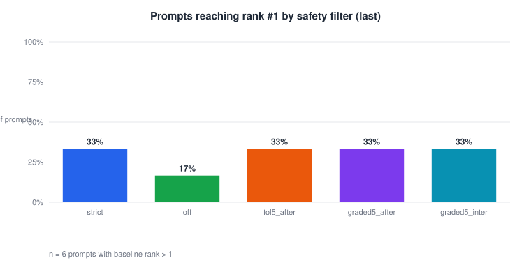

*Fig10. Share of prompts whose target token reached rank #1, per safety-filter variant, last-token-only candidate source (n = 6 prompts whose target did not start at rank #1).*

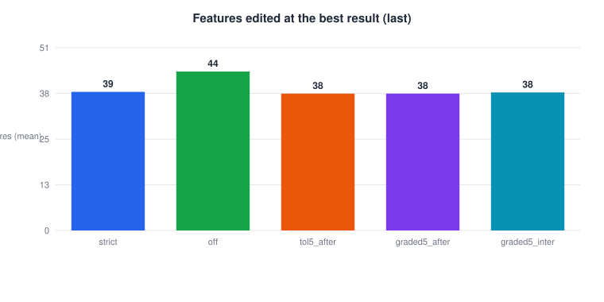

*Fig11. Mean number of SAE features muted or boosted at the best result found, per variant, last-token-only candidate source (n = 6).*

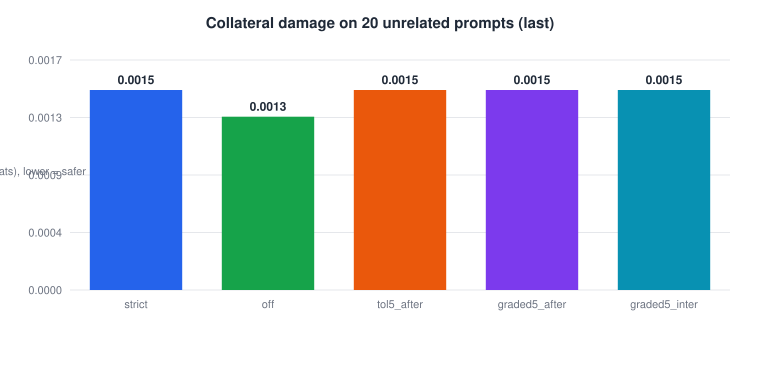

*Fig12. Mean KL divergence (nats) between the clean and edited next-token distributions on 20 unrelated prompts, per variant, last-token-only candidate source. Lower means less collateral change.*

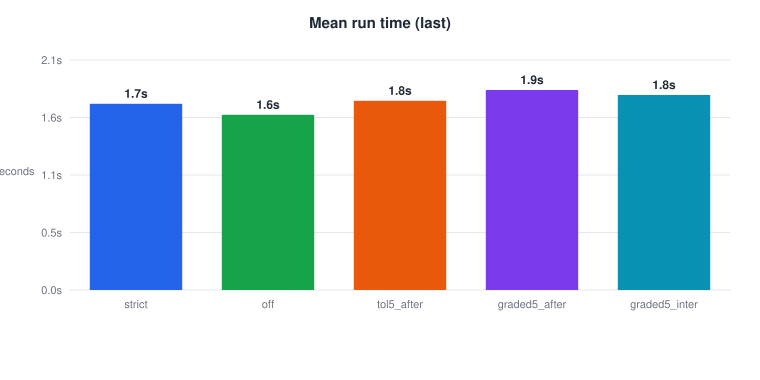

*Fig13. Mean model-compute time per run in seconds, per variant, last-token-only candidate source (n = 6).*

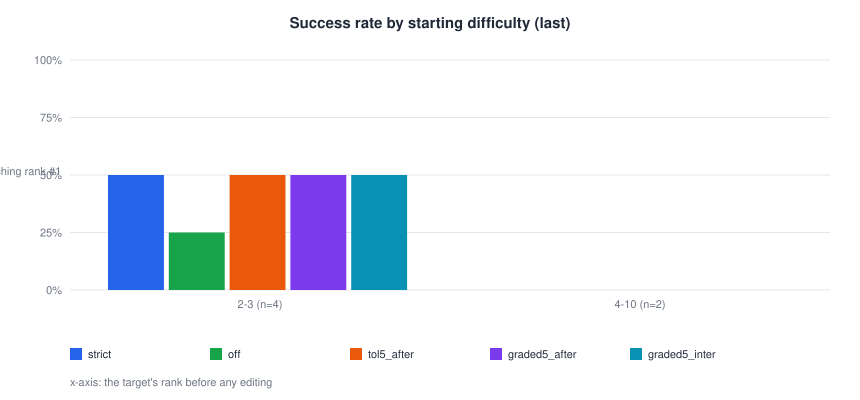

*Fig14. Share of prompts reaching rank #1 per safety-filter variant, grouped by how far down the target started (baseline rank bins), last mode.*

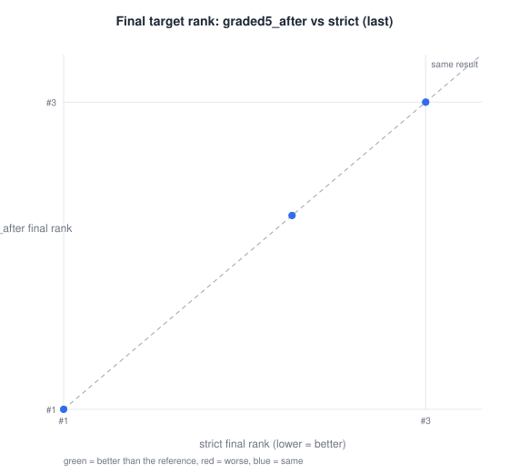

*Fig15. Final target rank per prompt under 'graded5_after' against the reference 'strict', last-token-only candidate source, log scale. Points below the dashed diagonal are better than the reference; each dot is one prompt (n = 6).*

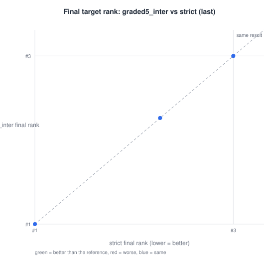

*Fig16. Final target rank per prompt under 'graded5_inter' against the reference 'strict', last-token-only candidate source, log scale. Points below the dashed diagonal are better than the reference; each dot is one prompt (n = 6).*

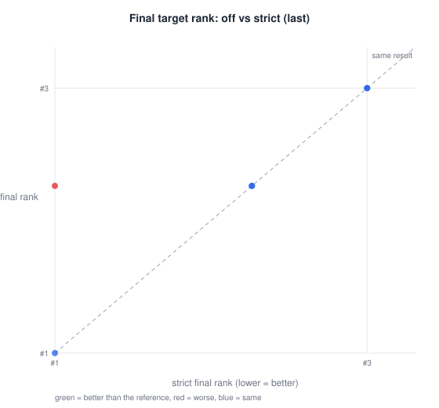

*Fig17. Final target rank per prompt under 'off' against the reference 'strict', last-token-only candidate source, log scale. Points below the dashed diagonal are better than the reference; each dot is one prompt (n = 6).*

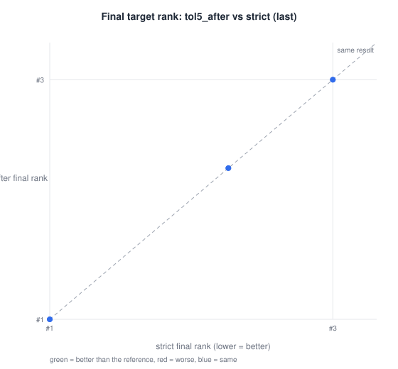

*Fig18. Final target rank per prompt under 'tol5_after' against the reference 'strict', last-token-only candidate source, log scale. Points below the dashed diagonal are better than the reference; each dot is one prompt (n = 6).*

## 4. Why the strict filter rejects features

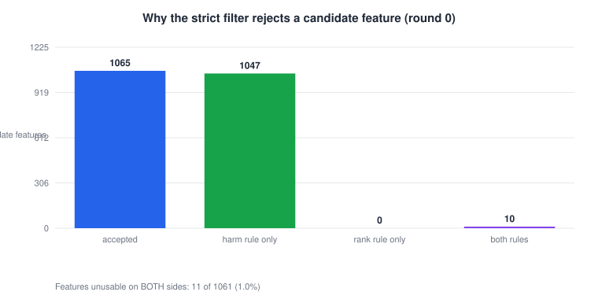

*Fig19. Verdicts of the strict safety filter on every round-0 candidate feature (mute and boost sides pooled) in the reference arm. Only 11 of 1061 features (1.0%) were unusable on both sides.*

## 5. Interpretation

_TO BE WRITTEN after the results are reviewed._ State which arms beat the reference (sign / McNemar p-values above), the cost in features/steps/time, and the collateral-damage comparison.

## 6. Limitations

- GPT-2 small, one layer, prompts not drawn at random.
- Success = rank #1 on the next token only.
- _(add any new caveats)_

## 7. Reproduction

```
python tools/make_paper_pack.py outputs/safety_batches/safety_filter_spec_quick.json --entry 21
```
Or: Batch tab -> select the result -> Build paper pack. Full provenance in `MANIFEST.json`.
